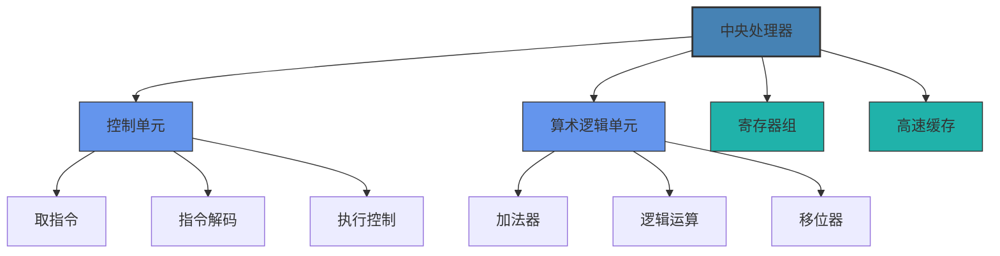
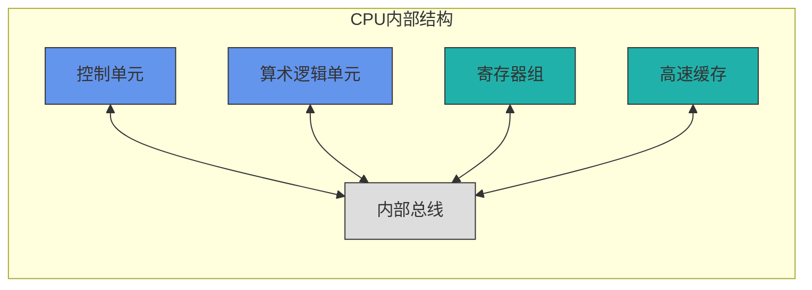
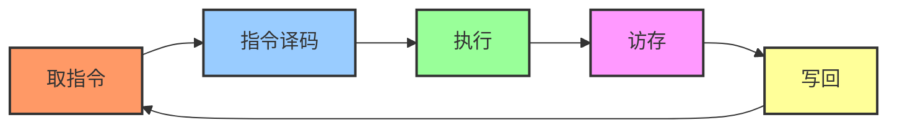
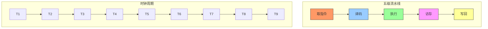
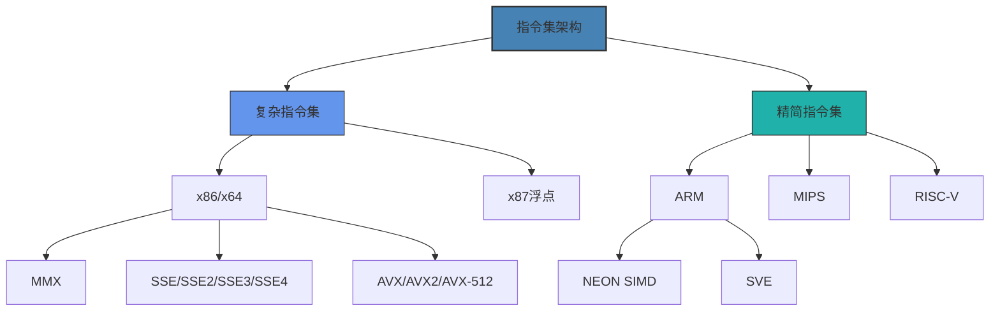
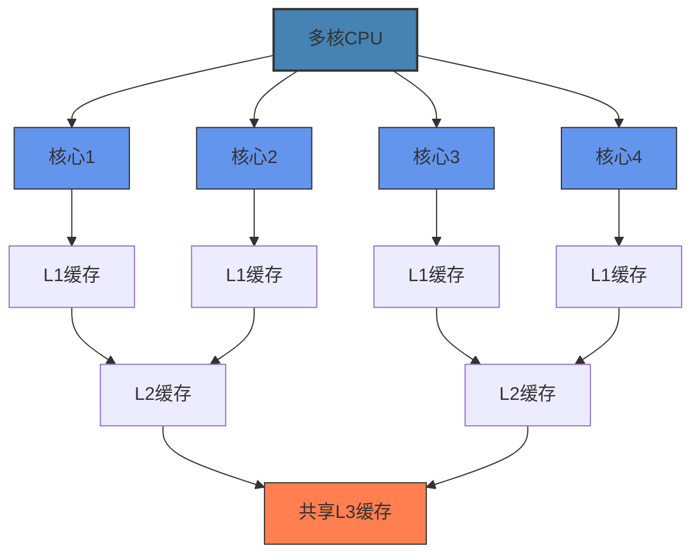

# CPU架构与工作原理

本章节将深入介绍中央处理器(CPU)的基本架构、工作原理和性能指标，帮助您全面了解计算机的"大脑"是如何工作的。

## 学习目标

完成本章学习后，您将能够：
- 理解CPU的基本组成部分及其功能
- 掌握指令执行周期和流水线技术原理
- 区分不同的CPU架构及其特点
- 了解多核处理器技术和并行计算原理
- 评估和比较不同CPU的性能指标

## 教学内容

### 第一部分：CPU基本组成

#### 1. CPU内部结构
- **控制单元(CU)**
  - 指令寄存器(IR)
  - 程序计数器(PC)
  - 指令译码器
  - 时序控制电路
  - 微操作生成器
- **算术逻辑单元(ALU)**
  - 算术运算电路
  - 逻辑运算电路
  - 移位运算电路
  - 标志寄存器
- **寄存器组**
  - 通用寄存器
  - 特殊功能寄存器
  - 状态寄存器
  - 地址寄存器
- **高速缓存**
  - L1缓存(指令缓存和数据缓存)
  - L2缓存
  - L3缓存(多核共享)

#### 2. 控制单元详解
- **指令获取与执行**
  - 取指令过程
  - 指令译码机制
  - 操作数获取
  - 指令执行控制
  - 结果存储
- **微程序控制**
  - 微指令与微程序
  - 微程序控制器结构
  - 微指令格式
  - 微程序执行流程
- **硬布线控制**
  - 组合逻辑电路实现
  - 时序逻辑控制
  - 与微程序控制的比较
  - 实际应用场景

#### 3. 算术逻辑单元(ALU)
- **整数运算**
  - 加减法电路
  - 乘法算法与电路
  - 除法算法与电路
  - 溢出检测
- **逻辑运算**
  - 与、或、非、异或操作
  - 位操作指令
  - 条件码生成
  - 状态标志设置
- **移位运算**
  - 逻辑移位
  - 算术移位
  - 循环移位
  - 桶形移位器

#### 4. 寄存器架构
- **寄存器类型与功能**
  - 数据寄存器
  - 地址寄存器
  - 程序计数器
  - 指令寄存器
  - 状态寄存器
- **寄存器组织方式**
  - 通用寄存器架构
  - 专用寄存器架构
  - 寄存器窗口技术
  - 寄存器重命名
- **寄存器访问优化**
  - 多端口寄存器文件
  - 寄存器层次结构
  - 寄存器旁路技术
  - 上下文切换优化

### 第二部分：CPU工作原理

#### 1. 指令执行周期
- **基本指令周期**
  - 取指令(Fetch)
  - 指令译码(Decode)
  - 执行(Execute)
  - 访存(Memory)
  - 写回(Write Back)
- **指令执行状态**
  - 时钟周期与机器周期
  - 状态转换
  - 控制信号时序
  - 数据通路控制
- **指令类型与执行差异**
  - 算术逻辑指令
  - 数据传送指令
  - 控制转移指令
  - 系统控制指令

#### 2. 流水线技术
- **流水线基本概念**
  - 流水线定义与原理
  - 流水线阶段划分
  - 吞吐量与延迟
  - 加速比计算
- **流水线冒险**
  - 结构冒险
  - 数据冒险
  - 控制冒险
  - 冒险检测机制
- **流水线优化技术**
  - 转发技术
  - 分支预测
  - 延迟槽
  - 动态调度

#### 3. 超标量与乱序执行
- **超标量处理器**
  - 多发射机制
  - 功能部件复制
  - 指令窗口
  - 完成单元
- **乱序执行**
  - 指令调度算法
  - 寄存器重命名
  - 保留站
  - 重排序缓冲区
- **投机执行**
  - 分支预测技术
  - 预测错误恢复
  - 投机执行的限制
  - 精确异常处理

#### 4. 中断与异常处理
- **中断基本概念**
  - 中断类型
  - 中断源
  - 中断请求信号
  - 中断向量
- **中断处理流程**
  - 中断检测
  - 中断响应
  - 上下文保存
  - 中断服务
  - 中断返回
- **异常处理**
  - 异常类型
  - 异常检测
  - 异常处理机制
  - 异常恢复

### 第三部分：CPU架构

#### 1. 指令集架构(ISA)
- **CISC架构**
  - 复杂指令集特点
  - x86架构概述
  - 寻址模式
  - 指令格式
- **RISC架构**
  - 精简指令集特点
  - ARM架构概述
  - MIPS架构
  - RISC-V开源架构
- **指令集扩展**
  - SIMD指令(SSE/AVX)
  - 虚拟化扩展
  - 加密指令扩展
  - 专用领域指令

#### 2. 微架构设计
- **前端设计**
  - 指令预取
  - 分支预测器
  - 指令解码
  - 微操作生成
- **执行引擎**
  - 指令调度
  - 执行单元
  - 乱序执行逻辑
  - 结果转发
- **后端设计**
  - 重排序缓冲区
  - 提交逻辑
  - 异常处理
  - 内存排序

#### 3. 多核与多线程技术
- **多核处理器**
  - 核心设计
  - 片上互连
  - 缓存一致性
  - 内存模型
- **超线程技术**
  - 同时多线程(SMT)
  - 资源共享机制
  - 线程调度
  - 性能影响因素
- **多处理器系统**
  - 对称多处理(SMP)
  - 非一致性内存访问(NUMA)
  - 多处理器互连
  - 可扩展性挑战

### 第四部分：CPU性能与优化

#### 1. CPU性能指标
- **时钟频率**
  - 基准频率
  - 睿频加速
  - 频率限制因素
  - 超频技术
- **IPC(每周期指令数)**
  - IPC计算方法
  - 影响IPC的因素
  - IPC与架构关系
  - 优化方向
- **缓存性能**
  - 缓存命中率
  - 缓存延迟
  - 缓存带宽
  - 缓存层次影响
- **功耗效率**
  - 热设计功耗(TDP)
  - 动态功耗管理
  - 性能每瓦特
  - 节能技术

#### 2. 基准测试与评估
- **CPU基准测试**
  - SPEC CPU测试
  - Geekbench
  - Cinebench
  - PassMark
- **工作负载分析**
  - 整数密集型
  - 浮点密集型
  - 内存密集型
  - 混合工作负载
- **性能瓶颈识别**
  - 处理器事件计数器
  - 性能监控单元(PMU)
  - 热点分析
  - 资源利用率

#### 3. CPU优化技术
- **微架构优化**
  - 分支预测优化
  - 缓存预取
  - 执行单元专业化
  - 微操作融合
- **编译器优化**
  - 指令调度
  - 循环展开
  - 函数内联
  - 向量化
- **软件优化**
  - 算法选择
  - 数据结构布局
  - 缓存友好设计
  - 并行化

#### 4. 新兴CPU技术
- **异构计算**
  - CPU+GPU协同
  - 专用加速器集成
  - 可重构计算
  - 片上系统(SoC)
- **3D堆叠技术**
  - 硅通孔技术(TSV)
  - 芯粒(Chiplet)设计
  - 堆叠内存
  - 3D集成电路
- **量子计算与未来**
  - 量子比特
  - 量子门
  - 量子优势
  - 混合计算模型

## 实践项目

1. **CPU性能测试与分析**：使用基准测试软件对不同型号的CPU进行测试，分析并比较其性能特点
   - 所需时间：8小时
   - 技术要求：基准测试软件使用，数据分析能力
   - 评估标准：测试方法合理性，数据分析深度，结论准确性

2. **指令集模拟器开发**：设计一个简单的指令集模拟器，能够执行基本的算术和逻辑运算
   - 所需时间：12小时
   - 技术要求：编程能力，指令集架构理解
   - 评估标准：功能完整性，代码质量，用户界面友好度

3. **流水线CPU设计**：使用硬件描述语言(如Verilog或VHDL)设计一个简单的五级流水线CPU
   - 所需时间：15小时
   - 技术要求：硬件描述语言，数字电路设计
   - 评估标准：设计正确性，流水线效率，冒险处理方法

4. **多核性能扩展性研究**：研究不同应用在增加CPU核心数时的性能扩展性，分析瓶颈因素
   - 所需时间：10小时
   - 技术要求：多线程编程，性能测试方法
   - 评估标准：实验设计合理性，数据分析深度，结论有效性

## 互动练习

### 自测题

1. **单选题**：以下哪项不是CPU控制单元的组成部分？
   - A. 指令寄存器
   - B. 程序计数器
   - C. 浮点运算器
   - D. 指令译码器
   
   

   
查看答案

   
C. 浮点运算器。浮点运算器是算术逻辑单元的一部分，而不是控制单元的组成部分。

   

2. **多选题**：以下哪些是流水线执行中可能出现的冒险？
   - A. 结构冒险
   - B. 数据冒险
   - C. 控制冒险
   - D. 内存冒险
   - E. 时序冒险
   
   

   
查看答案

   
A、B、C。流水线执行中的三种主要冒险是结构冒险、数据冒险和控制冒险。

   

3. **判断题**：RISC架构通常比CISC架构有更多的通用寄存器。
   
   

   
查看答案

   
正确。RISC架构通常拥有更多的通用寄存器，以减少内存访问次数，提高指令执行效率。

   

4. **填空题**：CPU执行指令的基本周期包括________、________、________、________和________五个阶段。
   
   

   
查看答案

   
取指令(Fetch)、指令译码(Decode)、执行(Execute)、访存(Memory)、写回(Write Back)

   

5. **简答题**：简述超标量处理器与标量处理器的区别，以及超标量技术的优势和挑战。
   
   

   
参考答案

   
超标量处理器能够在一个时钟周期内同时发射和执行多条指令，而标量处理器在一个时钟周期内只能执行一条指令。超标量技术的优势在于提高了指令级并行度，增加了处理器的吞吐量，但同时也带来了更复杂的指令调度、资源分配和冒险处理机制。超标量处理器面临的主要挑战包括：指令依赖关系检测、资源冲突解决、分支预测准确性要求高、复杂的重排序逻辑以及功耗增加等问题。

   

### 思考题

1. 随着摩尔定律逐渐放缓，单核性能提升遇到瓶颈，多核架构成为主流。请分析多核架构在提升计算性能方面的优势和局限性，以及如何设计应用程序才能更好地利用多核优势？

2. 分支预测是现代CPU提高性能的重要技术。请研究不同的分支预测算法，分析它们的工作原理、优缺点以及适用场景。结合实际案例，探讨分支预测失败对性能的影响。

3. RISC和CISC是两种主要的指令集架构设计理念。请比较这两种架构的优缺点，并分析为什么现代处理器设计中出现了两种架构相互借鉴融合的趋势？

4. 异构计算是近年来提高计算性能的重要方向。请探讨CPU与GPU、FPGA、专用加速器等协同工作的模式，分析不同计算任务适合的处理器类型，以及异构计算面临的挑战。

5. 量子计算被认为是未来计算技术的重要发展方向。请研究量子计算的基本原理，与经典计算的区别，以及量子计算可能对现有密码学和算法设计带来的影响。

## 学习资源

### 推荐教材
1. 《计算机组成与设计：硬件/软件接口》(David A. Patterson, John L. Hennessy)
2. 《现代处理器设计：超标量处理器基础》(John Paul Shen, Mikko H. Lipasti)
3. 《计算机体系结构：量化研究方法》(John L. Hennessy, David A. Patterson)
4. 《ARM系统开发者指南：设计与优化》(Andrew N. Sloss, Dominic Symes, Chris Wright)
5. 《Intel架构软件开发人员手册》(Intel官方文档)

### 在线资源
1. [CPU World](https://www.cpu-world.com/) - CPU规格和比较
2. [AnandTech CPU文章](https://www.anandtech.com/tag/cpus) - CPU架构分析
3. [计算机体系结构课程](https://www.coursera.org/learn/comparch) - Coursera课程
4. [CPU设计与实现](https://www.edx.org/course/computer-architecture) - edX课程
5. [Intel开发者专区](https://software.intel.com/content/www/us/en/develop/home.html)
6. [ARM开发者社区](https://developer.arm.com/)
7. [RISC-V基金会](https://riscv.org/) - RISC-V架构资源

### 实验工具
1. [GEM5](http://gem5.org/) - 计算机系统模拟平台
2. [QEMU](https://www.qemu.org/) - 开源处理器模拟器
3. [Vivado HLS](https://www.xilinx.com/products/design-tools/vivado.html) - 高级硬件设计工具
4. [Intel VTune Profiler](https://software.intel.com/content/www/us/en/develop/tools/vtune-profiler.html) - CPU性能分析工具
5. [Perf](https://perf.wiki.kernel.org/) - Linux性能分析工具

## 评估方式
- 课堂参与：10%
- 实验报告：30%
- 项目作业：30%
- 期末考试：30% 