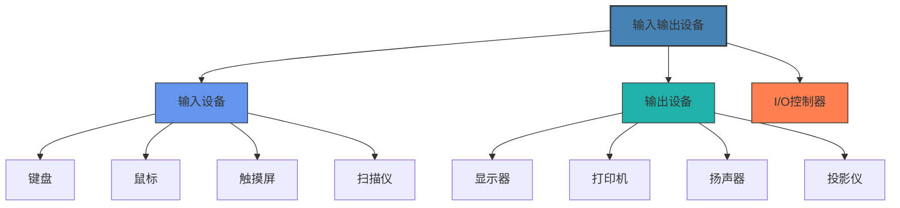
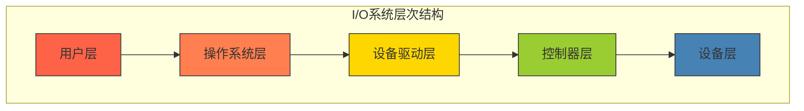
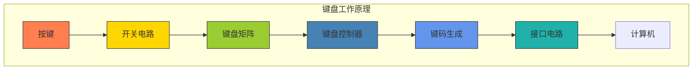
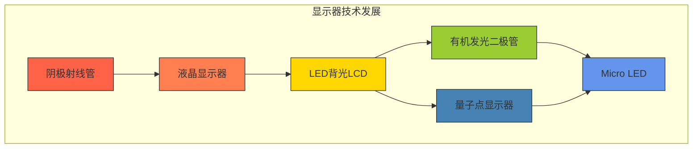

# 输入输出设备

本章节将详细介绍计算机系统中各种输入输出设备的工作原理、接口技术和应用特点，帮助您全面了解人机交互的硬件基础。

## 学习目标

完成本章学习后，您将能够：
- 理解输入输出设备的基本工作原理
- 掌握常见I/O接口标准及其特点
- 区分不同类型输入设备和输出设备的技术特性
- 了解I/O系统的性能指标和优化方法
- 评估和选择适合特定需求的输入输出设备

## 教学内容

### 第一部分：I/O系统基础

#### 1. I/O系统概述
- **I/O系统在计算机中的位置**
  - 冯·诺依曼架构回顾
  - I/O系统的演进
  - 人机交互的发展
  - I/O设备分类
- **I/O系统组成**
  - I/O设备
  - I/O接口(控制器)
  - 设备驱动程序
  - I/O软件层次
- **I/O操作方式**
  - 程序控制I/O
  - 中断驱动I/O
  - DMA(直接内存访问)
  - I/O处理器
- **I/O性能指标**
  - 带宽
  - 延迟
  - 响应时间
  - 吞吐量

#### 2. I/O接口与总线
- **I/O接口基本功能**
  - 数据缓冲
  - 控制与状态寄存器
  - 地址译码
  - 数据格式转换
- **系统总线**
  - 地址总线
  - 数据总线
  - 控制总线
  - 总线仲裁
- **外部总线标准**
  - USB(1.0/2.0/3.0/4.0)
  - FireWire(IEEE 1394)
  - Thunderbolt
  - HDMI与DisplayPort
- **无线接口技术**
  - 蓝牙
  - Wi-Fi
  - NFC
  - 红外线

#### 3. I/O控制方式
- **程序控制I/O**
  - 轮询机制
  - 忙等待
  - 优缺点分析
  - 适用场景
- **中断驱动I/O**
  - 中断机制
  - 中断处理流程
  - 中断向量表
  - 中断优先级
- **直接内存访问(DMA)**
  - DMA控制器
  - DMA传输模式
  - DMA通道
  - 与中断的配合
- **I/O通道与处理器**
  - 通道概念
  - 通道程序
  - 多路复用
  - 智能I/O处理器

#### 4. I/O软件层次
- **I/O软件层次结构**
  - 中断处理程序
  - 设备驱动程序
  - 设备无关软件
  - 用户层I/O软件
- **设备驱动程序**
  - 驱动程序结构
  - 驱动程序功能
  - 驱动程序接口
  - 即插即用技术
- **I/O调度**
  - 磁盘调度算法
  - I/O请求合并
  - 优先级调度
  - 实时I/O调度
- **虚拟设备**
  - 设备虚拟化
  - 虚拟设备接口
  - 设备模拟
  - 设备透传

### 第二部分：输入设备技术

#### 1. 键盘技术
- **键盘工作原理**
  - 机械开关
  - 薄膜开关
  - 电容式开关
  - 光学开关
- **键盘控制器**
  - 扫描电路
  - 键码生成
  - 防抖动处理
  - 多键冲突解决
- **键盘接口与协议**
  - PS/2接口
  - USB接口
  - 无线键盘技术
  - 蓝牙键盘
- **特殊键盘技术**
  - 机械键盘
  - 人体工学键盘
  - 游戏键盘
  - 虚拟键盘

#### 2. 鼠标与指针设备
- **鼠标工作原理**
  - 机械鼠标
  - 光电鼠标
  - 激光鼠标
  - 光学传感器
- **鼠标参数与性能**
  - DPI与分辨率
  - 轮询率
  - 加速度
  - 响应时间
- **其他指针设备**
  - 轨迹球
  - 触控板
  - 指点杆
  - 数位板
- **多点输入技术**
  - 多点触控
  - 手势识别
  - 空间定位
  - 3D交互

#### 3. 触摸屏技术
- **触摸屏类型**
  - 电阻式触摸屏
  - 电容式触摸屏
  - 表面声波触摸屏
  - 红外触摸屏
- **触摸屏工作原理**
  - 位置检测
  - 多点触控
  - 压力感应
  - 信号处理
- **触摸屏控制器**
  - 坐标计算
  - 噪声过滤
  - 校准技术
  - 手势识别
- **触摸屏应用**
  - 移动设备
  - 自助终端
  - 交互式电子白板
  - 工业控制面板

#### 4. 图像与视频输入设备
- **扫描仪技术**
  - CCD与CMOS传感器
  - 光学系统
  - 色彩处理
  - 分辨率与色深
- **数码相机原理**
  - 图像传感器
  - 镜头系统
  - 图像处理器
  - 存储接口
- **摄像头技术**
  - 网络摄像头
  - 高清摄像头
  - 立体摄像头
  - 深度相机
- **特殊图像输入设备**
  - 条码扫描器
  - 指纹识别器
  - 虹膜扫描仪
  - 3D扫描仪

#### 5. 语音与生物特征输入
- **麦克风技术**
  - 动圈式麦克风
  - 电容式麦克风
  - 拾音模式
  - 频率响应
- **语音识别基础**
  - 声音采集
  - 信号处理
  - 特征提取
  - 模式匹配
- **生物特征识别**
  - 指纹识别
  - 面部识别
  - 虹膜识别
  - 声纹识别
- **运动与姿态感应**
  - 加速度传感器
  - 陀螺仪
  - 磁力计
  - 体感控制器

### 第三部分：输出设备技术

#### 1. 显示器技术
- **显示器类型与原理**
  - CRT显示器
  - LCD显示器
  - LED显示器
  - OLED显示器
  - 量子点显示器
- **显示器参数**
  - 分辨率
  - 刷新率
  - 响应时间
  - 色域与色深
  - 亮度与对比度
- **显示接口**
  - VGA
  - DVI
  - HDMI
  - DisplayPort
  - USB Type-C
- **显示技术发展**
  - 高动态范围(HDR)
  - 自适应同步
  - 超高清(4K/8K)
  - 曲面显示器

#### 2. 打印机技术
- **打印机类型**
  - 针式打印机
  - 喷墨打印机
  - 激光打印机
  - 热敏打印机
  - 3D打印机
- **打印机工作原理**
  - 喷墨打印过程
  - 激光打印过程
  - 色彩管理
  - 打印分辨率
- **打印机接口与协议**
  - 并口
  - USB
  - 网络打印
  - 无线打印
- **打印机控制语言**
  - PCL
  - PostScript
  - PDF
  - XPS

#### 3. 音频输出设备
- **扬声器技术**
  - 动圈扬声器
  - 压电扬声器
  - 静电扬声器
  - 平板扬声器
- **音频放大器**
  - 前置放大器
  - 功率放大器
  - 数字放大器
  - 音频解码器
- **音频接口**
  - 模拟音频接口
  - 数字音频接口
  - 蓝牙音频
  - USB音频
- **立体声与环绕声**
  - 立体声原理
  - 5.1/7.1环绕声
  - 杜比全景声
  - 对象式音频

#### 4. 特殊输出设备
- **投影显示技术**
  - LCD投影仪
  - DLP投影仪
  - 激光投影仪
  - 短焦投影
- **头戴式显示设备**
  - VR头显
  - AR眼镜
  - 混合现实设备
  - 光场显示
- **触觉反馈设备**
  - 力反馈
  - 振动反馈
  - 触觉显示器
  - 力反馈控制器
- **全息显示技术**
  - 全息投影
  - 体积显示
  - 光场显示
  - 裸眼3D

### 第四部分：I/O系统性能与优化

#### 1. I/O性能评估
- **I/O性能指标**
  - 吞吐量
  - 响应时间
  - 利用率
  - 可靠性
- **I/O基准测试**
  - 合成基准测试
  - 应用基准测试
  - 系统基准测试
  - 性能分析工具
- **I/O瓶颈分析**
  - CPU瓶颈
  - 内存瓶颈
  - 总线瓶颈
  - 设备瓶颈
- **I/O负载特征**
  - 顺序访问
  - 随机访问
  - 读写比例
  - 请求大小分布

#### 2. I/O系统优化
- **硬件优化**
  - 高速缓存
  - 多通道设计
  - 并行接口
  - 专用处理器
- **驱动程序优化**
  - 异步I/O
  - 零拷贝技术
  - 批处理请求
  - 中断合并
- **操作系统优化**
  - I/O调度算法
  - 缓冲区管理
  - 预读与回写
  - 资源分配
- **应用程序优化**
  - I/O访问模式
  - 缓冲策略
  - 异步编程
  - 数据局部性

#### 3. I/O虚拟化技术
- **设备虚拟化基础**
  - 设备模拟
  - 准虚拟化
  - 直接I/O分配
  - SR-IOV技术
- **虚拟机I/O性能**
  - 虚拟化开销
  - 性能优化策略
  - 资源调度
  - 服务质量保证
- **网络I/O虚拟化**
  - 虚拟网卡
  - 虚拟交换机
  - 网络功能虚拟化
  - 软件定义网络
- **存储I/O虚拟化**
  - 虚拟磁盘
  - 存储池
  - 精简配置
  - 快照与克隆

#### 4. 新兴I/O技术
- **非易失性内存Express(NVMe)**
  - NVMe架构
  - 命令队列
  - 多队列支持
  - 性能优势
- **计算存储(Computational Storage)**
  - 近数据处理
  - 可编程存储设备
  - 应用场景
  - 性能优势
- **可组合基础设施**
  - CXL技术
  - 资源池化
  - 动态分配
  - 内存语义I/O
- **量子I/O**
  - 量子传感器
  - 量子通信接口
  - 量子态读取
  - 未来展望

## 实践项目

1. **输入设备性能测试与分析**：设计测试方法评估不同类型键盘、鼠标的响应时间和精确度
   - 所需时间：8小时
   - 技术要求：输入设备测试方法，数据分析能力
   - 评估标准：测试方法合理性，数据分析深度，结论准确性

2. **显示器性能评估系统**：开发一个工具测量和评估显示器的响应时间、色彩准确度和运动模糊
   - 所需时间：12小时
   - 技术要求：图像处理，显示技术理解
   - 评估标准：功能完整性，测量准确性，用户界面友好度

3. **多媒体I/O系统优化**：针对视频编辑或游戏等应用场景，设计并实现I/O系统优化方案
   - 所需时间：15小时
   - 技术要求：系统性能分析，I/O优化技术
   - 评估标准：优化效果，方案可行性，实施难度

4. **人机交互设备原型设计**：设计并实现一种新型人机交互设备的原型，如手势识别、眼动追踪等
   - 所需时间：20小时
   - 技术要求：传感器应用，信号处理，人机交互设计
   - 评估标准：创新性，可用性，技术实现

## 互动练习

### 自测题

1. **单选题**：以下哪种I/O控制方式对CPU的占用最少？
   - A. 程序控制I/O
   - B. 中断驱动I/O
   - C. 直接内存访问(DMA)
   - D. 轮询
   
   

   
查看答案

   
C. 直接内存访问(DMA)。DMA允许外设直接与内存交换数据，无需CPU干预每次数据传输，大大减少了CPU占用。

   

2. **多选题**：以下哪些是常见的触摸屏技术？
   - A. 电阻式
   - B. 电容式
   - C. 表面声波
   - D. 红外线
   - E. 磁感应
   
   

   
查看答案

   
A、B、C、D。电阻式、电容式、表面声波和红外线都是常见的触摸屏技术。

   

3. **判断题**：USB 3.0与USB 2.0完全兼容，可以互相替代使用而不影响功能。
   
   

   
查看答案

   
部分正确。USB 3.0向下兼容USB 2.0，即USB 3.0接口可以连接USB 2.0设备，但会以USB 2.0速度工作；而USB 2.0接口无法发挥USB 3.0设备的全部功能和速度。

   

4. **填空题**：在显示器技术中，________是指显示器每秒能够显示的帧数，而________是指像素从一种状态变化到另一种状态所需的时间。
   
   

   
查看答案

   
刷新率；响应时间

   

5. **简答题**：简述DMA(直接内存访问)的工作原理及其优势。
   
   

   
参考答案

   
直接内存访问(DMA)是一种允许外设在没有CPU干预的情况下直接访问系统内存的机制。其工作原理是：CPU首先设置DMA控制器的寄存器，指定数据源地址、目标地址和传输数量；然后启动DMA控制器；DMA控制器请求总线控制权；获得总线控制权后，DMA控制器直接控制内存和I/O设备之间的数据传输；传输完成后，DMA控制器通过中断通知CPU。

   
DMA的主要优势包括：大幅减少CPU干预，提高系统效率；适合大块数据传输；降低CPU负载，使CPU可以同时执行其他任务；减少上下文切换开销；提高I/O操作的吞吐量。这使得DMA特别适合高速I/O设备，如网络适配器、磁盘控制器和图形卡等。

   

### 思考题

1. 随着虚拟现实(VR)和增强现实(AR)技术的发展，对输入输出设备提出了新的要求。请分析VR/AR应用对I/O设备的特殊需求，以及当前技术如何满足这些需求，并探讨未来可能的技术发展方向。

2. 触觉反馈是人机交互中的重要环节，但目前在消费电子产品中的应用相对有限。请研究现有的触觉反馈技术，分析其工作原理、应用场景和局限性，并探讨如何改进触觉反馈以提供更逼真的用户体验。

3. 随着物联网(IoT)的兴起，各种新型传感器被广泛应用。请选择三种不同类型的传感器，分析它们的工作原理、性能特点和应用场景，并讨论它们如何与传统计算机I/O系统集成。

4. 人机交互技术正在从传统的键盘鼠标向多模态交互方向发展。请比较分析语音交互、手势交互、眼动追踪等新型交互方式的技术原理、优缺点和适用场景，并预测未来人机交互的发展趋势。

5. I/O虚拟化是云计算和数据中心的关键技术。请分析不同I/O虚拟化技术(如设备模拟、准虚拟化、SR-IOV等)的工作原理、性能特点和适用场景，并探讨如何在保证安全性的前提下提高虚拟化环境中的I/O性能。

## 学习资源

### 推荐教材
1. 《计算机系统结构》(张晨曦, 贾玉华)
2. 《计算机体系结构：量化研究方法》(John L. Hennessy, David A. Patterson)
3. 《现代操作系统》(Andrew S. Tanenbaum)
4. 《人机交互基础》(Alan Dix, Janet Finlay, Gregory Abowd, Russell Beale)
5. 《显示技术原理与应用》(李屹东)

### 在线资源
1. [DisplayNinja](https://www.displayninja.com/) - 显示器技术与评测
2. [RTings](https://www.rtings.com/) - 显示器与音频设备测试
3. [USB-IF官方网站](https://www.usb.org/) - USB技术标准与规范
4. [VESA官方网站](https://vesa.org/) - 显示接口标准
5. [人机交互课程](https://www.coursera.org/learn/human-computer-interaction) - Coursera课程
6. [计算机I/O系统设计](https://ocw.mit.edu/courses/electrical-engineering-and-computer-science/) - MIT开放课程
7. [输入设备技术博客](https://deskthority.net/) - 键盘与输入设备资源

### 实验工具
1. [HWINFO](https://www.hwinfo.com/) - 硬件信息与监控工具
2. [DisplayCAL](https://displaycal.net/) - 显示器校准工具
3. [Input Lag Tester](https://www.leobodnar.com/testufo/) - 输入延迟测试
4. [Audacity](https://www.audacityteam.org/) - 音频分析工具
5. [Arduino](https://www.arduino.cc/) - 输入输出设备原型开发平台
6. [OpenCV](https://opencv.org/) - 计算机视觉库，用于图像输入处理

## 评估方式
- 课堂参与：10%
- 实验报告：30%
- 项目作业：30%
- 期末考试：30% 