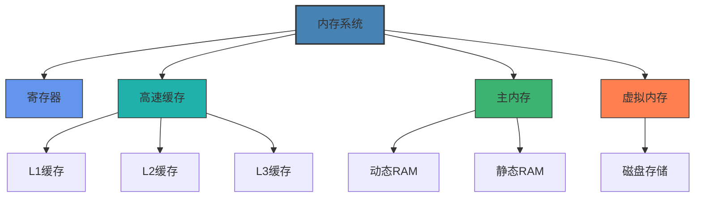
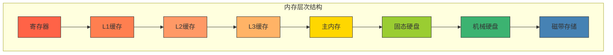
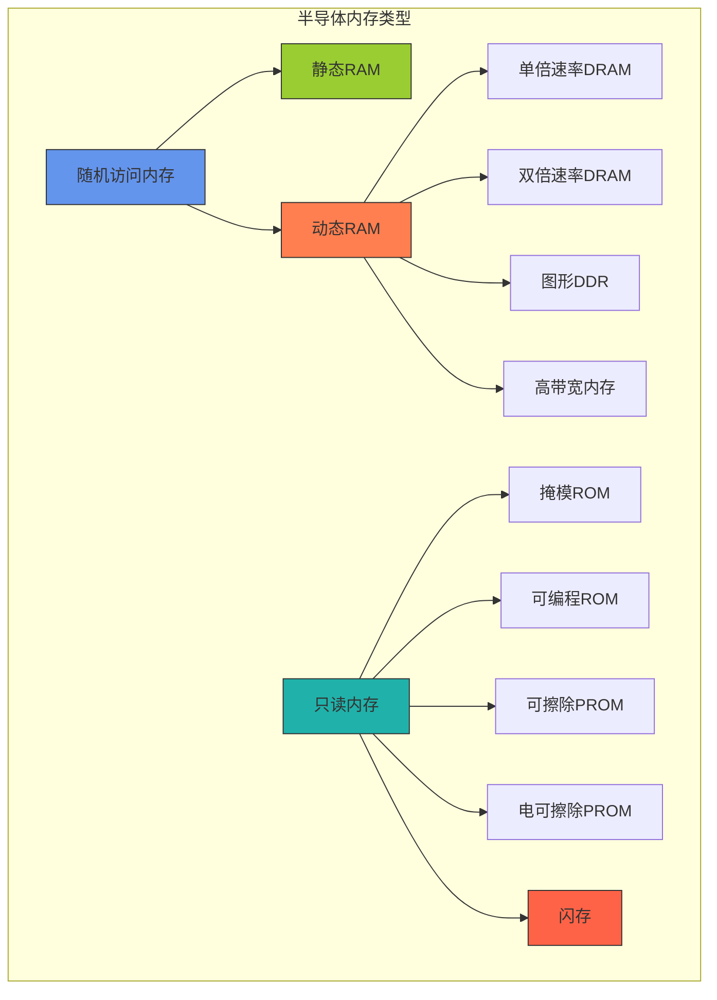
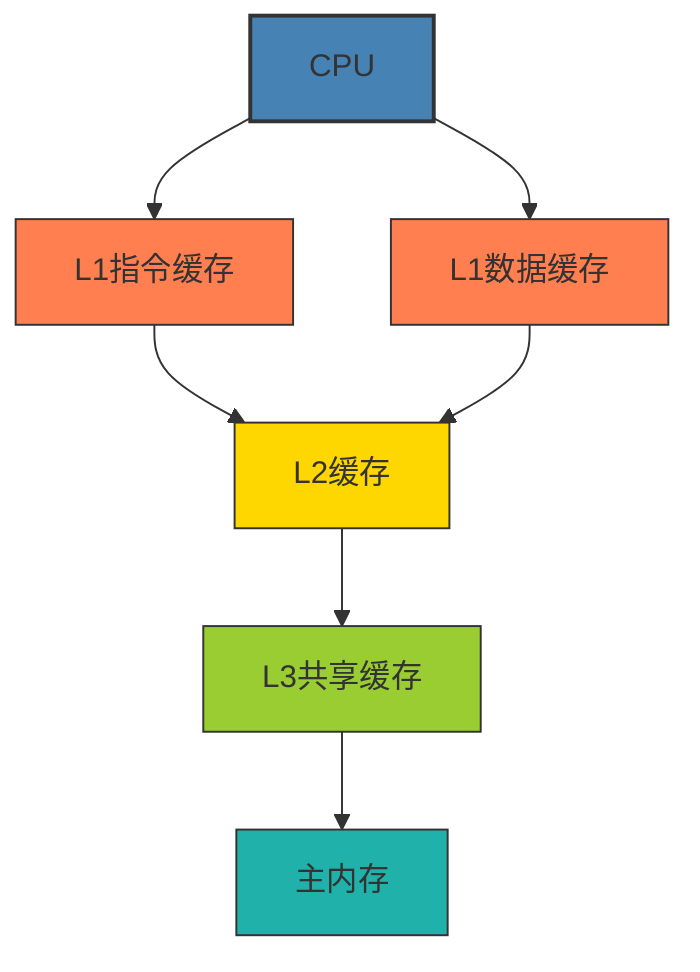
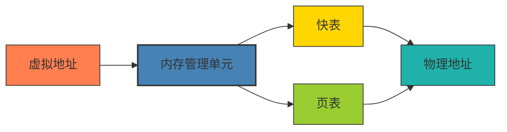

# 内存类型与工作机制

本章节将详细介绍计算机内存系统的类型、层次结构和工作机制，帮助您理解数据在计算机中如何存储和访问。

## 学习目标

完成本章学习后，您将能够：
- 理解内存层次结构及其设计原理
- 区分不同类型的内存技术及其特点
- 掌握高速缓存的工作原理和优化策略
- 了解虚拟内存的概念和实现机制
- 分析内存系统对计算机性能的影响

## 教学内容

### 第一部分：内存层次结构

#### 1. 内存层次概述
- **内存层次设计原理**
  - 速度与容量的权衡
  - 局部性原理
  - 成本效益考量
  - 访问时间差异
- **典型内存层次**
  - 寄存器
  - 高速缓存(L1/L2/L3)
  - 主内存(RAM)
  - 辅助存储(磁盘/SSD)
  - 远程存储
- **层次间数据传输**
  - 块传输
  - 预取机制
  - 写回与直写策略
  - 一致性维护

#### 2. 内存性能指标
- **访问时间**
  - 延迟定义与测量
  - 影响因素分析
  - 优化策略
  - 实际应用中的延迟
- **带宽**
  - 理论带宽计算
  - 实际带宽测量
  - 带宽瓶颈分析
  - 多通道技术
- **容量与密度**
  - 存储密度
  - 芯片容量演进
  - 物理极限
  - 新型存储技术
- **可靠性指标**
  - 错误率
  - 纠错能力
  - 使用寿命
  - 数据保留时间

#### 3. 局部性原理
- **时间局部性**
  - 定义与特点
  - 程序行为分析
  - 利用时间局部性的技术
  - 实际案例研究
- **空间局部性**
  - 定义与特点
  - 内存访问模式
  - 利用空间局部性的技术
  - 数据布局优化
- **局部性的程序优化**
  - 循环优化
  - 数据结构设计
  - 内存访问模式调整
  - 编译器优化技术

#### 4. 内存地址映射
- **物理地址与逻辑地址**
  - 地址空间概念
  - 地址转换基本原理
  - 地址总线宽度
  - 寻址能力
- **内存控制器**
  - 基本功能与结构
  - 地址译码
  - 刷新控制
  - 时序生成
- **内存映射技术**
  - 线性映射
  - 分段映射
  - 分页映射
  - 段页式映射

### 第二部分：内存类型与技术

#### 1. 半导体内存基础
- **存储单元结构**
  - 晶体管与电容器
  - SRAM单元
  - DRAM单元
  - 非易失性存储单元
- **内存芯片组织**
  - 行列寻址
  - 字线与位线
  - 存储阵列
  - 感知放大器
- **内存接口与协议**
  - 地址线与数据线
  - 控制信号
  - 时序要求
  - 总线协议

#### 2. 动态随机访问内存(DRAM)
- **DRAM基本原理**
  - 电容存储
  - 刷新机制
  - 读写操作
  - 破坏性读出
- **DRAM演进**
  - 传统DRAM
  - 快页模式DRAM
  - EDO DRAM
  - SDRAM
  - DDR/DDR2/DDR3/DDR4/DDR5
- **DRAM控制与时序**
  - RAS/CAS信号
  - 预充电
  - 刷新周期
  - 时序参数(tCL, tRCD, tRP, tRAS)
- **DRAM特殊技术**
  - 突发模式
  - 交错存取
  - 自刷新
  - 电源管理

#### 3. 静态随机访问内存(SRAM)
- **SRAM基本原理**
  - 触发器存储
  - 无需刷新
  - 读写操作
  - 非破坏性读出
- **SRAM类型**
  - 异步SRAM
  - 同步突发SRAM
  - 流水线突发SRAM
  - 零总线周转SRAM
- **SRAM应用**
  - 高速缓存
  - 寄存器文件
  - 嵌入式系统
  - 网络设备
- **SRAM与DRAM比较**
  - 速度对比
  - 密度与成本
  - 功耗特性
  - 应用场景选择

#### 4. 非易失性内存技术
- **ROM技术**
  - 掩模ROM
  - PROM
  - EPROM
  - EEPROM
- **闪存技术**
  - NOR闪存
  - NAND闪存
  - 多层单元(MLC/TLC/QLC)
  - 3D NAND技术
- **新型非易失性内存**
  - 相变内存(PCM)
  - 磁阻内存(MRAM)
  - 铁电内存(FeRAM)
  - 电阻式内存(ReRAM)
- **持久性内存**
  - 英特尔傲腾技术
  - NVDIMM
  - 持久性内存编程模型
  - 应用场景

### 第三部分：高速缓存技术

#### 1. 缓存基本原理
- **缓存的作用与设计目标**
  - 桥接速度差异
  - 利用局部性原理
  - 减少内存访问延迟
  - 提高系统吞吐量
- **缓存层次结构**
  - L1指令缓存与数据缓存
  - L2统一缓存
  - L3共享缓存
  - 多级缓存协作
- **缓存操作基本流程**
  - 读操作流程
  - 写操作流程
  - 缓存命中与缺失
  - 替换策略

#### 2. 缓存映射策略
- **直接映射**
  - 工作原理
  - 地址映射方式
  - 优点与缺点
  - 冲突问题
- **全相联映射**
  - 工作原理
  - 地址映射方式
  - 优点与缺点
  - 查找机制
- **组相联映射**
  - 工作原理
  - 地址映射方式
  - 组相联度选择
  - 性能权衡
- **缓存索引优化**
  - 集索引哈希
  - 页着色技术
  - 组相联预测
  - 虚拟索引物理标记

#### 3. 缓存一致性策略
- **写策略**
  - 写直达(Write-Through)
  - 写回(Write-Back)
  - 写分配(Write-Allocate)
  - 非写分配(No-Write-Allocate)
- **替换算法**
  - 最近最少使用(LRU)
  - 最不经常使用(LFU)
  - 随机替换
  - 伪LRU实现
- **多核缓存一致性**
  - 一致性问题来源
  - MESI协议
  - MOESI协议
  - 目录式协议
- **缓存优化技术**
  - 预取技术
  - 受害者缓存
  - 独占缓存
  - 非阻塞缓存

#### 4. 缓存性能分析
- **缓存命中率**
  - 命中率定义与测量
  - 影响命中率的因素
  - 提高命中率的方法
  - 工作负载特性分析
- **缓存失效分类**
  - 强制性失效
  - 容量性失效
  - 冲突性失效
  - 一致性失效
- **缓存性能评估**
  - 平均内存访问时间
  - 缓存失效代价
  - 缓存带宽利用率
  - 能耗效率
- **缓存调优技术**
  - 软件优化方法
  - 数据布局调整
  - 循环变换
  - 缓存分块

### 第四部分：虚拟内存技术

#### 1. 虚拟内存基本概念
- **虚拟内存的目标**
  - 扩展地址空间
  - 内存保护
  - 内存共享
  - 程序隔离
- **虚拟地址与物理地址**
  - 地址空间概念
  - 地址转换过程
  - 页表结构
  - 地址空间大小
- **页面管理**
  - 页面大小选择
  - 大页面支持
  - 页面对齐
  - 页面状态

#### 2. 页表结构与管理
- **线性页表**
  - 基本结构
  - 地址转换过程
  - 优点与缺点
  - 内存开销
- **多级页表**
  - 二级页表
  - 三级页表
  - 四级页表
  - x86-64页表结构
- **反向页表**
  - 工作原理
  - 哈希页表
  - 优点与缺点
  - 实现挑战
- **页表项内容**
  - 存在位
  - 修改位
  - 访问位
  - 保护位
  - 缓存控制位

#### 3. 地址转换加速
- **转换后备缓冲区(TLB)**
  - TLB结构与工作原理
  - 多级TLB
  - TLB命中率优化
  - TLB一致性维护
- **页表缓存**
  - 页表缓存机制
  - 与TLB的区别
  - 实现方式
  - 性能影响
- **大页面支持**
  - 大页面优势
  - 实现机制
  - 应用场景
  - 操作系统支持
- **地址空间标识符(ASID)**
  - ASID作用
  - 上下文切换优化
  - 实现方式
  - 硬件支持

#### 4. 页面置换与内存管理
- **页面置换算法**
  - 最优算法(OPT)
  - 最近最少使用(LRU)
  - 先进先出(FIFO)
  - 时钟算法(Clock)
  - 最不常用(LFU)
- **工作集模型**
  - 工作集定义
  - 工作集跟踪
  - 页面抖动
  - 工作集调度
- **页面调度策略**
  - 请求调页
  - 预调页
  - 抖动控制
  - 页面锁定
- **内存超额分配**
  - 交换空间管理
  - 页面回收
  - 内存压缩
  - 内存不足处理

## 实践项目

1. **内存性能测试与分析**：使用内存基准测试工具测试不同类型内存的性能特性，分析延迟、带宽和访问模式对性能的影响
   - 所需时间：8小时
   - 技术要求：内存测试工具使用，数据分析能力
   - 评估标准：测试方法合理性，数据分析深度，结论准确性

2. **缓存模拟器开发**：设计一个简单的缓存模拟器，能够模拟不同缓存策略下的命中率和性能表现
   - 所需时间：12小时
   - 技术要求：编程能力，缓存原理理解
   - 评估标准：功能完整性，代码质量，用户界面友好度

3. **内存访问模式优化**：分析和优化一个内存密集型应用程序，通过调整数据布局和访问模式提高缓存命中率
   - 所需时间：10小时
   - 技术要求：性能分析工具使用，代码优化能力
   - 评估标准：优化前后性能对比，优化方法合理性，代码质量

4. **虚拟内存管理模拟**：实现一个简单的虚拟内存管理系统，包括页表结构、地址转换和页面置换算法
   - 所需时间：15小时
   - 技术要求：操作系统原理理解，编程能力
   - 评估标准：功能实现完整性，算法正确性，性能表现

## 互动练习

### 自测题

1. **单选题**：以下哪种内存类型需要定期刷新以保持数据？
   - A. SRAM
   - B. DRAM
   - C. ROM
   - D. NVRAM
   
   

   
查看答案

   
B. DRAM。动态随机访问内存使用电容存储数据，需要定期刷新以防止电荷泄漏导致数据丢失。

   

2. **多选题**：以下哪些是常见的缓存映射方式？
   - A. 直接映射
   - B. 全相联映射
   - C. 组相联映射
   - D. 线性映射
   - E. 随机映射
   
   

   
查看答案

   
A、B、C。常见的缓存映射方式包括直接映射、全相联映射和组相联映射。

   

3. **判断题**：在虚拟内存系统中，页面大小越小越好，因为这样可以减少内部碎片。
   
   

   
查看答案

   
错误。虽然较小的页面大小可以减少内部碎片，但会增加页表大小，降低TLB命中率，并增加页面交换的开销。页面大小需要在多种因素间权衡。

   

4. **填空题**：在缓存系统中，________策略是指当写操作发生时，数据同时写入缓存和主内存；而________策略是指数据仅写入缓存，只有在被替换出缓存时才写回主内存。
   
   

   
查看答案

   
写直达(Write-Through)；写回(Write-Back)

   

5. **简答题**：简述多级页表的工作原理及其相对于线性页表的优势。
   
   

   
参考答案

   
多级页表将页表分为多个层次，每一级页表项指向下一级页表，最后一级页表项指向实际的物理页框。多级页表的主要优势在于可以节省内存空间，因为对于未使用的地址空间区域，不需要创建完整的页表项，只需在上级页表中标记为无效即可。这对于稀疏使用的大型虚拟地址空间特别有效。此外，多级页表还便于共享页表的某些部分，支持更灵活的内存保护机制。但多级页表的缺点是地址转换需要多次内存访问，增加了地址转换的延迟，这通常通过TLB来缓解。

   

### 思考题

1. 随着计算机系统中处理器核心数量的增加，缓存一致性维护变得越来越复杂。请分析多核系统中缓存一致性的挑战，比较不同的一致性协议(如MESI、MOESI、目录式协议)的优缺点，并探讨未来可能的解决方案。

2. 虚拟内存是现代操作系统的重要组成部分。请分析在大内存容量和多核处理器环境下，传统虚拟内存设计面临的挑战，以及如何优化虚拟内存系统以适应新的硬件特性和应用需求。

3. 新型非易失性内存技术(如PCM、MRAM、ReRAM)有望改变传统的内存层次结构。请探讨这些技术的工作原理、优缺点，以及它们可能如何影响未来计算机系统的内存架构设计。

4. 缓存优化是提高程序性能的重要手段。请选择一个实际的计算密集型算法(如矩阵乘法、排序或图算法)，分析其内存访问模式，并提出针对现代缓存层次结构的优化策略，同时评估这些优化的效果。

5. 内存带宽已经成为许多高性能计算应用的瓶颈。请研究现代内存技术(如HBM、GDDR6、DDR5)的带宽优化方法，分析这些技术的工作原理、优缺点，以及它们在不同应用场景中的适用性。

## 学习资源

### 推荐教材
1. 《计算机体系结构：量化研究方法》(John L. Hennessy, David A. Patterson)
2. 《现代处理器设计：超标量处理器基础》(John Paul Shen, Mikko H. Lipasti)
3. 《计算机系统结构》(张晨曦, 贾玉华)
4. 《存储器系统：从微处理器到超级计算机》(Bruce Jacob, Spencer Ng, David Wang)
5. 《高速缓存设计与优化》(Steven Przybylski)

### 在线资源
1. [Memory Systems Tutorial](https://www.cs.cmu.edu/afs/cs/academic/class/15213-f15/www/lectures/) - CMU课程讲义
2. [DRAM Operation and Timing Diagrams](https://www.systemverilog.io/design/dram-interface/)
3. [Cache Optimization](https://software.intel.com/content/www/us/en/develop/articles/cache-optimization.html) - Intel开发者指南
4. [Virtual Memory Resources](https://pages.cs.wisc.edu/~remzi/OSTEP/vm-intro.pdf) - 操作系统教程
5. [Memory Hierarchy Design](https://www.coursera.org/learn/comparch) - Coursera课程
6. [JEDEC内存标准](https://www.jedec.org/standards-documents/docs/jesd-79-4a)
7. [非易失性内存研究](https://nvmw.ucsd.edu/) - 非易失性内存研讨会资料

### 实验工具
1. [MemTest86](https://www.memtest86.com/) - 内存测试工具
2. [Intel Memory Latency Checker](https://software.intel.com/content/www/us/en/develop/articles/intelr-memory-latency-checker.html)
3. [STREAM Benchmark](https://www.cs.virginia.edu/stream/) - 内存带宽测试
4. [Cachegrind](https://valgrind.org/docs/manual/cg-manual.html) - 缓存分析工具
5. [DineroIV](http://pages.cs.wisc.edu/~markhill/DineroIV/) - 缓存模拟器
6. [perf](https://perf.wiki.kernel.org/) - Linux性能分析工具

## 评估方式
- 课堂参与：10%
- 实验报告：30%
- 项目作业：30%
- 期末考试：30% 