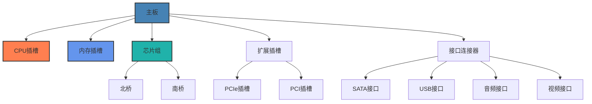

# 主板与总线技术

本章节将介绍计算机主板的结构、功能以及各种总线技术，帮助你理解计算机系统的核心连接组件。

## 学习目标

完成本章学习后，你将能够：
- 理解主板的基本结构和功能
- 掌握芯片组的作用和演进历程
- 了解各种总线技术的特点和应用
- 具备选择合适主板的能力
- 认识主板上各种接口的用途

## 教学内容

### 第一部分：主板基础知识（4学时）

#### 1. 主板结构与布局
- **主板的定义与作用**
  - 计算机系统的"母板"
  - 各硬件组件的连接平台
  - 系统集成与通信的基础
  - 电源分配与管理
- **主板物理结构**
  - PCB板层结构
  - 铜箔走线与阻抗控制
  - 电源层与接地层
  - 信号完整性设计
- **主板主要组件布局**
  - CPU区域设计
  - 内存区域布局
  - 电源管理区域
  - 扩展槽与接口分布
- **主板设计考量因素**
  - 散热设计
  - 电磁兼容性
  - 信号干扰控制
  - 电源稳定性

#### 2. 芯片组功能与演进
- **芯片组的定义与作用**
  - 系统控制核心
  - 数据流管理
  - 外设控制与集成
  - 系统功能扩展
- **传统北桥与南桥架构**
  - 北桥功能与连接
  - 南桥功能与连接
  - 前端总线(FSB)
  - DMI总线连接
- **现代集成芯片组架构**
  - CPU集成北桥功能
  - PCH(平台控制器集线器)
  - 系统代理(System Agent)
  - 集成显示控制器
- **芯片组技术演进**
  - Intel芯片组发展历程
  - AMD芯片组发展历程
  - 功能整合趋势
  - 制程工艺提升

#### 3. 主板尺寸规格
- **ATX规格系列**
  - 标准ATX(305×244mm)
  - Micro-ATX(244×244mm)
  - Mini-ATX(284×208mm)
  - FlexATX(229×191mm)
- **ITX规格系列**
  - Mini-ITX(170×170mm)
  - Nano-ITX(120×120mm)
  - Pico-ITX(100×72mm)
  - Mobile-ITX(75×45mm)
- **服务器与工作站规格**
  - EATX(Extended ATX)
  - SSI CEB/EEB
  - BTX系列规格
  - 工业主板规格
- **规格选择考量**
  - 机箱兼容性
  - 扩展性需求
  - 散热空间
  - 应用场景适配

#### 4. BIOS/UEFI系统
- **BIOS基础**
  - BIOS的定义与功能
  - POST开机自检
  - 硬件初始化
  - 引导加载过程
- **UEFI现代固件**
  - UEFI架构优势
  - 图形化界面
  - 安全启动机制
  - 模块化设计
- **BIOS/UEFI设置**
  - 系统时钟配置
  - 启动设备顺序
  - 硬件参数调整
  - 安全与电源管理
- **固件更新与维护**
  - 固件版本管理
  - 更新方法与风险
  - 双BIOS设计
  - 恢复机制

### 第二部分：总线技术（5学时）

#### 1. 总线定义与分类
- **总线的基本概念**
  - 总线的定义
  - 总线的基本功能
  - 总线的物理实现
  - 总线协议层次
- **按功能分类**
  - 数据总线
  - 地址总线
  - 控制总线
  - 电源总线
- **按连接层次分类**
  - 内部总线
  - 系统总线
  - 外部总线(I/O总线)
  - 扩展总线
- **总线特性参数**
  - 总线宽度
  - 总线速率
  - 总线带宽
  - 仲裁机制

#### 2. 系统总线演进
- **早期系统总线**
  - ISA总线
  - EISA总线
  - VESA本地总线
  - 早期总线的局限性
- **PCI总线时代**
  - PCI总线架构
  - PCI总线特性
  - PCI设备枚举
  - PCI中断与资源分配
- **AGP图形接口**
  - AGP设计目标
  - AGP带宽与版本
  - 直接内存访问
  - 纹理映射加速
- **现代系统总线**
  - HyperTransport(AMD)
  - QuickPath/UltraPath(Intel)
  - 片上互连总线
  - 点对点连接架构

#### 3. PCI与PCIe技术
- **PCI Express基础**
  - PCIe架构设计
  - 串行点对点连接
  - 分层协议结构
  - 兼容性与优势
- **PCIe技术特点**
  - 全双工通信
  - 分组交换机制
  - 热插拔支持
  - 链路训练与管理
- **PCIe代际发展**
  - PCIe 1.0/2.0/3.0/4.0/5.0/6.0
  - 带宽翻倍演进
  - 编码效率提升
  - 功耗优化技术
- **PCIe槽位与配置**
  - x1/x4/x8/x16槽位
  - 向下兼容性
  - 多GPU配置
  - 带宽分配机制

#### 4. 其他总线标准
- **存储总线**
  - IDE/PATA接口
  - SATA演进(1.0/2.0/3.0)
  - SAS企业存储接口
  - NVMe存储协议
- **USB总线**
  - USB架构与拓扑
  - USB 1.0/2.0/3.0/4.0演进
  - USB供电规范
  - USB协议栈
- **显示接口总线**
  - VGA模拟接口
  - DVI数字接口
  - HDMI多媒体接口
  - DisplayPort接口
- **高速串行总线**
  - Thunderbolt技术
  - FireWire(IEEE 1394)
  - 光纤通道(Fibre Channel)
  - InfiniBand高性能计算

#### 5. 总线协议与通信
- **总线仲裁机制**
  - 集中式仲裁
  - 分布式仲裁
  - 自仲裁机制
  - 优先级管理
- **总线传输模式**
  - 同步传输
  - 异步传输
  - 突发传输
  - DMA传输
- **总线错误处理**
  - 奇偶校验
  - CRC校验
  - 重传机制
  - 错误报告与恢复
- **总线性能优化**
  - 缓冲技术
  - 流水线传输
  - 并行传输
  - 分层设计

### 第三部分：主板接口与扩展（4学时）

#### 1. CPU插槽类型
- **Intel CPU插槽**
  - LGA1700/1200/1151插槽
  - 插槽设计与演进
  - 针脚分布与功能
  - 兼容性考量
- **AMD CPU插槽**
  - AM4/AM5插槽
  - 插槽设计特点
  - 针脚布局
  - 平台演进
- **服务器CPU插槽**
  - LGA2066/3647/4189
  - SP3/SP5插槽
  - 多CPU互连
  - 企业级特性
- **插槽安装与维护**
  - CPU安装步骤
  - 散热器安装
  - 常见问题排查
  - 兼容性列表

#### 2. 内存插槽规格
- **DIMM内存插槽**
  - DDR4 DIMM插槽
  - DDR5 DIMM插槽
  - 插槽键位设计
  - 通道配置
- **SO-DIMM插槽**
  - 笔记本内存规格
  - 小型设备应用
  - 性能与标准DIMM对比
  - 兼容性考量
- **特殊内存插槽**
  - RIMM(Rambus)
  - FB-DIMM(全缓冲)
  - LRDIMM(负载降低)
  - 非易失性DIMM
- **内存插槽配置**
  - 单/双/四通道配置
  - 内存插槽颜色编码
  - 最大支持容量
  - 频率与时序支持

#### 3. 存储接口
- **SATA接口**
  - SATA接口版本与速率
  - SATA电源与数据连接
  - SATA Express
  - eSATA外部接口
- **M.2接口**
  - M.2插槽尺寸规格
  - SATA与PCIe模式
  - 键位类型(B/M键)
  - 散热考量
- **U.2/SFF-8639接口**
  - 企业级NVMe连接
  - 热插拔支持
  - 与M.2对比
  - 应用场景
- **其他存储接口**
  - IDE传统接口
  - SCSI接口
  - Mini-SAS HD
  - OCuLink接口

#### 4. 扩展槽与接口
- **PCIe扩展槽**
  - x1/x4/x8/x16规格
  - 钢铁加固设计
  - 插槽共享机制
  - 电气特性
- **专用扩展接口**
  - CNVi无线网卡接口
  - TPM安全模块接口
  - 前置面板接口
  - RGB灯效接口
- **音频与网络接口**
  - 高清音频前后置接口
  - 光纤音频接口
  - 千兆/万兆网络接口
  - Wi-Fi天线接口
- **调试与管理接口**
  - 诊断LED/数码管
  - BIOS刷新按钮
  - 清CMOS跳线
  - USB BIOS闪回

### 第四部分：主板选购要点（3学时）

#### 1. 平台兼容性
- **处理器兼容性**
  - 支持的CPU系列
  - 处理器代际支持
  - BIOS更新与支持
  - 功耗支持等级
- **内存兼容性**
  - 内存技术支持(DDR4/DDR5)
  - 最大支持容量
  - 内存频率支持
  - XMP/EXPO内存超频
- **扩展设备兼容性**
  - 显卡尺寸兼容
  - 多显卡支持
  - PCIe设备兼容
  - 存储设备支持
- **操作系统兼容性**
  - Windows支持
  - Linux兼容性
  - macOS黑苹果可能性
  - 驱动支持情况

#### 2. 功能需求评估
- **基本功能需求**
  - 核心性能需求
  - 接口数量需求
  - 扩展性要求
  - 稳定性期望
- **特殊功能需求**
  - 超频能力
  - 多显卡支持
  - 专业音频需求
  - 网络性能要求
- **外观与设计需求**
  - 尺寸限制
  - RGB灯效需求
  - 散热设计期望
  - 静音需求
- **预算平衡考量**
  - 成本效益分析
  - 关键功能优先级
  - 长期使用规划
  - 升级可能性

#### 3. 扩展性考量
- **未来升级空间**
  - CPU升级路径
  - 内存扩展能力
  - 存储扩展选项
  - 接口升级可能
- **多设备支持**
  - 多GPU配置
  - 多存储设备
  - 多外设连接
  - 高带宽设备支持
- **特殊扩展需求**
  - 虚拟化支持
  - RAID功能
  - 远程管理
  - 专业应用加速
- **物理扩展限制**
  - 机箱兼容性
  - 散热空间
  - 电源限制
  - 布线管理

#### 4. 品质与可靠性
- **电源设计**
  - VRM相数
  - 供电质量
  - 电容质量
  - 散热设计
- **PCB设计质量**
  - 层数与厚度
  - 铜箔厚度
  - 信号完整性
  - 抗干扰能力
- **散热解决方案**
  - 散热片设计
  - 热管技术
  - 主动散热
  - 温度监控
- **品牌与售后**
  - 品牌声誉
  - 保修政策
  - 技术支持
  - 用户评价

## 视频教程：主板结构详解

以下是一个详细介绍主板结构和功能的视频教程，帮助你直观地了解主板的各个组件：

<iframe src="//player.bilibili.com/player.html?bvid=BV1xQ4y1b7JS&page=1" style="position: absolute; width: 100%; height: 100%; top: 0; left: 0;" scrolling="no" border="0" frameborder="no" framespacing="0" allowfullscreen="true"> </iframe>

如果视频无法播放，请[点击此处在哔哩哔哩观看](https://www.bilibili.com/video/BV1xQ4y1b7JS/)。

## 实践项目

1. **主板解析实验**：选择一款主板，识别并标注其主要组件和接口，制作详细的组件图解
   - 所需时间：6小时
   - 技术要求：主板识别能力，图像处理能力
   - 评估标准：标注准确性，解释清晰度，图解质量

2. **主板选型方案**：针对特定应用场景(如游戏、办公、服务器等)，设计并比较3种不同配置的主板选型方案
   - 所需时间：8小时
   - 技术要求：需求分析能力，参数对比能力，成本效益分析
   - 评估标准：需求匹配度，方案合理性，性价比分析

3. **BIOS设置实验**：进行BIOS/UEFI设置的实践操作，包括基本设置、超频设置、启动顺序配置等
   - 所需时间：4小时
   - 技术要求：BIOS操作能力，参数理解能力
   - 评估标准：操作准确性，参数设置合理性，实验报告质量

4. **总线性能测试**：设计并执行不同接口(如USB、SATA、PCIe)的性能测试，对比分析各接口的实际性能表现
   - 所需时间：10小时
   - 技术要求：测试工具使用，数据收集与分析能力
   - 评估标准：测试方法合理性，数据准确性，分析深度

## 互动练习

### 自测题

1. **单选题**：现代主板中，以下哪个功能已经被集成到CPU内部？
   - A. 南桥功能
   - B. 北桥功能
   - C. SATA控制器
   - D. 音频控制器
   
   

   
查看答案

   
B. 北桥功能。现代CPU已经集成了内存控制器和PCIe控制器等原本属于北桥的功能。

   

2. **多选题**：以下哪些是PCIe总线的特点？
   - A. 串行传输
   - B. 点对点连接
   - C. 共享总线架构
   - D. 全双工通信
   - E. 向下兼容性
   
   

   
查看答案

   
A、B、D、E。PCIe采用串行传输、点对点连接、全双工通信方式，并且具有向下兼容性。而共享总线架构是PCI总线的特点。

   

3. **判断题**：M.2接口只能用于连接NVMe固态硬盘。
   
   

   
查看答案

   
错误。M.2接口是一种物理接口规范，可以支持多种协议，包括PCIe(用于NVMe SSD)、SATA(用于SATA SSD)，甚至USB、SDIO等。

   

4. **填空题**：ATX主板标准尺寸为________毫米×________毫米。
   
   

   
查看答案

   
305×244

   

5. **简答题**：简述UEFI相比传统BIOS的主要优势。
   
   

   
参考答案

   
UEFI相比传统BIOS的主要优势包括：1)支持图形化界面，操作更直观；2)启动更快，支持快速启动技术；3)支持2TB以上大容量硬盘启动；4)提供安全启动机制，增强系统安全性；5)模块化设计，便于扩展和更新；6)支持网络功能，可远程诊断和更新；7)提供更丰富的驱动支持；8)支持更多的设备和接口。

   

### 思考题

1. 随着CPU集成了越来越多的功能(如内存控制器、PCIe控制器等)，主板芯片组的角色正在发生变化。请分析这种变化对主板设计和未来发展的影响。

2. 比较PCIe与其前身PCI总线的技术差异，并分析PCIe为何能够成为现代计算机中主导的扩展总线标准。

3. 主板供电系统(VRM)的设计对CPU性能发挥有重要影响。请讨论VRM相数、电容质量等因素如何影响系统稳定性和超频能力。

4. 随着计算机向小型化、集成化方向发展，SoC(片上系统)技术越来越普及。请思考SoC技术对传统主板行业可能带来的挑战和机遇。

5. 分析不同尺寸规格主板(如ATX、Micro-ATX、Mini-ITX)的优缺点，并讨论在不同应用场景下的适用性。

## 学习资源

### 推荐教材
1. 《计算机硬件系统实用教程》
2. 《计算机组成原理》(唐朔飞)
3. 《现代计算机总线技术》
4. 《主板维修从入门到精通》
5. 《BIOS技术内幕》

### 在线资源
1. [主板结构与工作原理](https://www.bilibili.com/video/BV1xQ4y1b7JS)
2. [计算机总线技术详解](https://www.icourse163.org/course/HUST-1205809816)
3. [PCIe技术深度解析](https://www.coursera.org/learn/pcie-technology)
4. [UEFI编程指南](https://uefi.org/learning_center)
5. [主板选购指南](https://www.pcworld.com/article/394837/how-to-choose-the-right-motherboard-for-your-computer.html)

### 视频教程
1. [主板结构详解](https://www.bilibili.com/video/BV1xQ4y1b7JS)
2. [BIOS设置全攻略](https://www.youtube.com/watch?v=D1R2ttrvBgI)
3. [PCIe总线工作原理](https://www.bilibili.com/video/BV1Wb411J7j8)
4. [主板故障诊断与维修](https://www.bilibili.com/video/BV1xs411Q7Ng)
5. [芯片组技术发展史](https://www.youtube.com/watch?v=5DHYj7Xcr-o)

### 实验工具
1. [CPU-Z - 硬件信息检测工具](https://www.cpuid.com/softwares/cpu-z.html)
2. [AIDA64 - 系统诊断与基准测试](https://www.aida64.com/)
3. [HWiNFO - 硬件分析与监控工具](https://www.hwinfo.com/)
4. [PCIe带宽测试工具](https://www.techpowerup.com/download/techpowerup-pcie-benchmark/)
5. [主板诊断卡使用指南](https://www.computerhope.com/issues/ch000474.htm)

## 评估方式
- 课堂参与：10%
- 实验报告：30%
- 项目作业：30%
- 期末考试：30% 