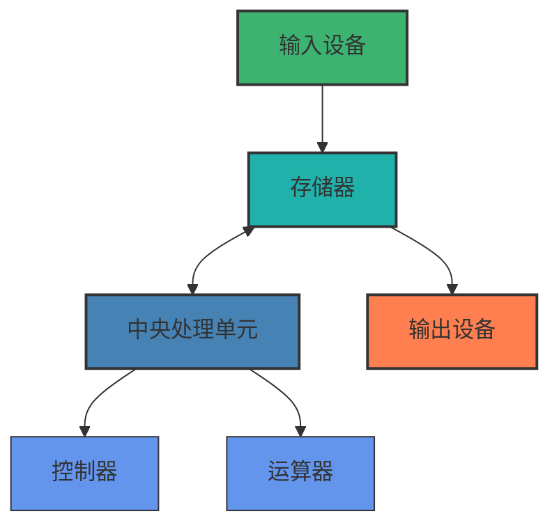
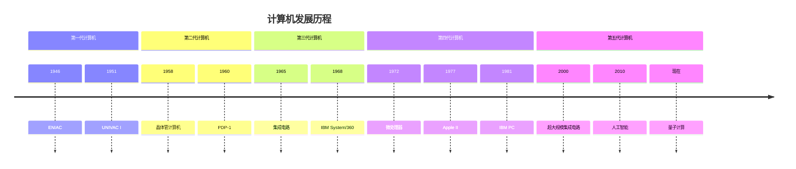
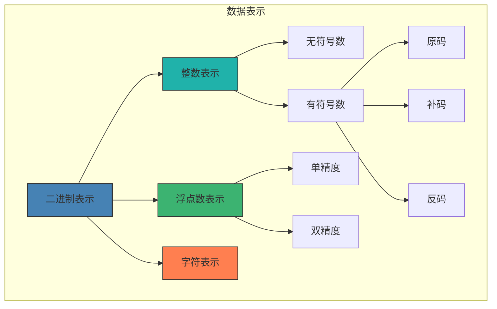
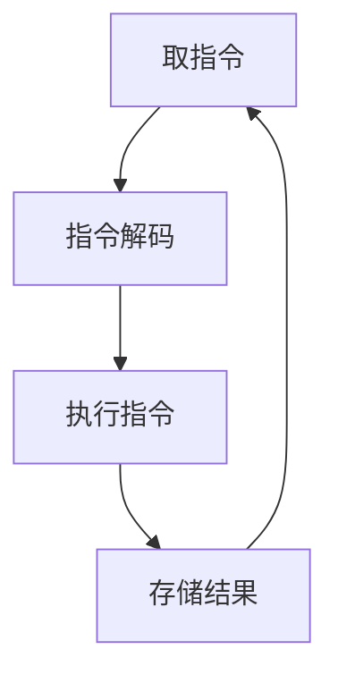
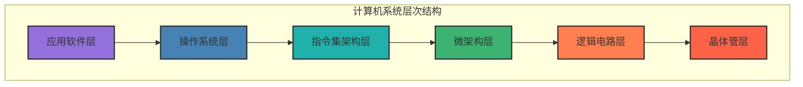
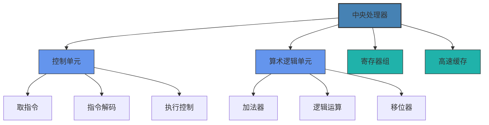
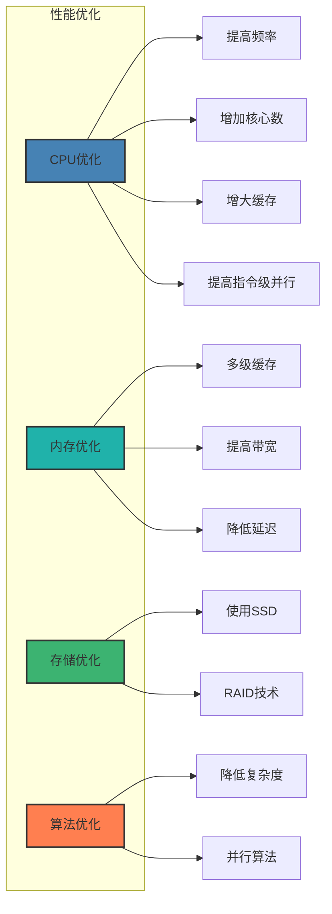
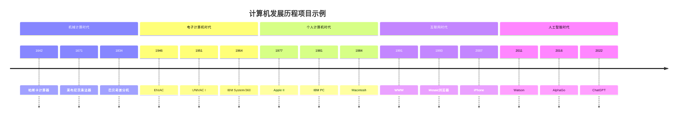
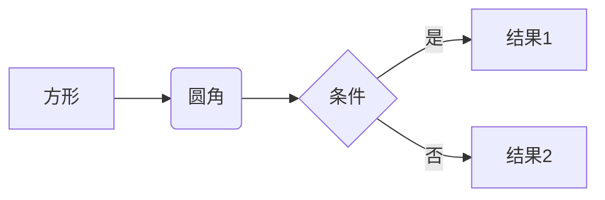

# 计算机组成原理概述

本章节将介绍计算机系统的基本组成原理和架构，帮助你建立对计算机硬件系统的整体认识。



## 学习目标

完成本章学习后，你将能够：
- 了解计算机发展的关键历史阶段和里程碑
- 理解冯·诺依曼架构的基本原理和组成部分
- 掌握计算机工作的基本原理和数据表示方法
- 认识现代计算机系统的层次结构

## 教学内容

### 第一部分：计算机发展历史（5学时）



#### 1. 计算机的诞生与早期发展
- **机械计算时代**
  - 算盘与计数工具
  - 帕斯卡计算器(1642)
  - 莱布尼茨乘法器(1671)
  - 巴贝奇差分机与分析机
- **电子计算机的诞生**
  - ABC计算机(1942)
  - ENIAC(1946)：第一台通用电子计算机
  - EDVAC与存储程序概念
  - UNIVAC I：第一台商用计算机
- **早期计算机的特点**
  - 体积庞大，耗电量高
  - 真空管技术
  - 机器语言编程
  - 有限的存储容量和计算能力

#### 2. 计算机代的划分与特点
- **第一代计算机(1946-1957)**
  - 真空管技术
  - 机器语言编程
  - 批处理系统
  - 代表机型：ENIAC, UNIVAC I
- **第二代计算机(1958-1964)**
  - 晶体管技术
  - 汇编语言与高级语言出现
  - 操作系统雏形
  - 代表机型：IBM 7090, PDP-1
- **第三代计算机(1965-1971)**
  - 集成电路技术
  - 操作系统普及
  - 多道程序设计
  - 代表机型：IBM System/360, PDP-8
- **第四代计算机(1972-至今)**
  - 大规模集成电路
  - 个人计算机兴起
  - 图形用户界面
  - 代表机型：Apple II, IBM PC
- **第五代计算机(现在与未来)**
  - 超大规模集成电路
  - 并行处理
  - 人工智能
  - 量子计算技术

#### 3. 摩尔定律与计算机性能发展趋势
- **摩尔定律的提出**
  - Gordon Moore的观察(1965)
  - 集成电路上的晶体管数量每18-24个月翻一番
  - 历史验证与现状
- **处理器性能发展**
  - 晶体管数量增长历程
  - 时钟频率发展与瓶颈
  - 多核架构的兴起
  - 专用处理器发展
- **存储技术发展**
  - 内存容量增长
  - 存储介质演进
  - 存储层次结构优化
  - 新型非易失性存储技术
- **摩尔定律的挑战与未来**
  - 物理极限挑战
  - 量子效应干扰
  - 散热问题
  - 后摩尔时代技术方向

#### 4. 现代计算机的分类与应用
- **按规模与用途分类**
  - 超级计算机
  - 大型机/服务器
  - 工作站
  - 个人计算机
  - 嵌入式系统
- **按处理数据的方式分类**
  - 数字计算机
  - 模拟计算机
  - 混合计算机
- **按体系结构分类**
  - CISC架构
  - RISC架构
  - 并行计算机
  - 分布式系统
- **新兴计算范式**
  - 云计算
  - 边缘计算
  - 量子计算
  - 生物计算

### 第二部分：冯·诺依曼架构（5学时）

```mermaid
graph TD
    subgraph 冯·诺依曼架构
        CPU[中央处理单元]
        MEM[存储器]
        IO[输入/输出设备]
        
        subgraph CPU
            CU[控制器]
            ALU[运算器]
        end
        
        MEM <--> CPU
        IO <--> MEM
    end
    
    style CPU fill:#4682b4,stroke:#333,stroke-width:2px
    style CU fill:#6495ed,stroke:#333,stroke-width:1px
    style ALU fill:#6495ed,stroke:#333,stroke-width:1px
    style MEM fill:#20b2aa,stroke:#333,stroke-width:2px
    style IO fill:#ff7f50,stroke:#333,stroke-width:2px
```

#### 1. 存储程序概念
- **存储程序的核心思想**
  - 指令与数据同等对待
  - 指令与数据存储在同一存储器中
  - 指令可被当作数据修改
  - 程序执行的顺序控制
- **存储程序的意义**
  - 通用性与灵活性
  - 程序控制的自动化
  - 软件与硬件的分离
  - 现代计算机的基础
- **程序执行的基本过程**
  - 取指令-解码-执行循环
  - 指令计数器的作用
  - 指令与数据的区分方式
  - 程序控制流的实现


#### 2. 五大基本组成部分
- **运算器**
  - 算术逻辑单元(ALU)
  - 累加器与通用寄存器
  - 状态寄存器
  - 数据通路
- **控制器**
  - 指令寄存器
  - 指令译码器
  - 程序计数器
  - 时序控制逻辑
- **存储器**
  - 主存储器结构
  - 地址空间
  - 字与字长
  - 存储单元寻址
- **输入设备**
  - 数据输入方式
  - 常见输入设备类型
  - 输入设备接口
  - 输入数据的编码与处理
- **输出设备**
  - 数据输出方式
  - 常见输出设备类型
  - 输出设备接口
  - 输出数据的处理与展示

#### 3. 冯·诺依曼瓶颈
- **瓶颈的定义与表现**
  - 存储器与处理器之间的数据传输限制
  - 共享总线的竞争
  - 内存访问速度与处理器速度不匹配
  - 指令与数据共享通道的限制
- **瓶颈的影响**
  - 处理器等待数据的空闲时间
  - 系统性能的限制因素
  - 能耗与效率问题
  - 并行计算的挑战
- **缓解瓶颈的技术**
  - 高速缓存层次结构
  - 指令流水线
  - 乱序执行
  - 多核与多处理器架构

#### 4. 哈佛架构与改进
- **哈佛架构的基本原理**
  - 指令存储器与数据存储器分离
  - 独立的指令总线与数据总线
  - 指令与数据可并行访问
  - 典型应用场景
- **改进的冯·诺依曼架构**
  - 多级缓存结构
  - 指令与数据缓存分离
  - 高速缓存一致性
  - 预取技术
- **现代混合架构**
  - 哈佛架构与冯·诺依曼架构的结合
  - 缓存层次中的分离与统一
  - RISC与CISC架构中的实现差异
  - 嵌入式系统中的应用
- **架构比较与选择**
  - 性能对比
  - 复杂度与成本
  - 应用场景适用性
  - 未来发展趋势

### 第三部分：计算机工作原理（6学时）



#### 1. 二进制数据表示
- **二进制基础**
  - 二进制数制
  - 位、字节与字
  - 进制转换
  - 二进制运算
- **整数表示**
  - 原码表示
  - 反码表示
  - 补码表示
  - 无符号数与有符号数



- **浮点数表示**
  - IEEE 754标准
  - 单精度与双精度
  - 特殊值表示
  - 浮点运算特性
- **字符与多媒体数据编码**
  - ASCII与Unicode编码
  - 图像数据表示
  - 音频数据编码
  - 视频数据压缩

#### 2. 机器周期与指令执行
- **机器周期基础**
  - 时钟周期与机器周期
  - 指令周期的组成
  - 状态周期
  - 总线周期
- **指令执行过程**
  - 取指周期(Fetch)
  - 解码周期(Decode)
  - 执行周期(Execute)
  - 访存周期(Memory)
  - 写回周期(Write Back)
- **指令流水线**
  - 流水线原理
  - 流水线阶段划分
  - 流水线冒险
  - 流水线优化技术
- **中断与异常处理**
  - 中断类型与优先级
  - 中断处理流程
  - 异常检测与处理
  - 上下文切换

#### 3. 时钟频率与性能关系
- **时钟与同步**
  - 时钟信号的生成与分配
  - 时钟频率的含义
  - 同步电路设计
  - 时钟偏斜问题
- **频率与性能指标**
  - 每秒指令数(IPS)
  - 每周期指令数(IPC)
  - 平均指令执行时间(CPI)
  - MIPS与FLOPS
- **频率提升的挑战**
  - 功耗与散热问题
  - 信号完整性
  - 时序约束
  - 物理极限
- **超越频率的性能提升**
  - 架构优化
  - 并行处理
  - 专用电路
  - 算法优化

#### 4. 计算机系统层次结构
- **硬件层次结构**
  - 门电路级
  - 寄存器传输级
  - 处理器-存储器级
  - 操作系统级
  - 应用程序级
- **存储层次结构**
  - 寄存器
  - 高速缓存
  - 主存储器
  - 辅助存储器
  - 远程存储
- **软件层次结构**
  - 机器语言
  - 汇编语言
  - 高级语言
  - 应用软件
- **网络层次结构**
  - 物理连接
  - 数据链路
  - 网络互连
  - 端到端通信
  - 应用服务

### 第四部分：现代计算机系统架构（6学时）



#### 1. 中央处理器(CPU)
- **CPU内部结构**
  - 控制单元
  - 算术逻辑单元
  - 寄存器组
  - 内部总线
- **指令集架构**
  - CISC与RISC比较
  - x86架构特点
  - ARM架构特点
  - 指令集扩展(SSE, AVX等)
- **CPU性能指标**
  - 时钟频率
  - 核心数与线程数
  - 缓存大小与层次
  - IPC(每周期指令数)
- **多核处理器技术**
  - 多核架构设计
  - 缓存一致性
  - 非均匀内存访问(NUMA)
  - 超线程技术



#### 2. 内存系统
- **内存层次结构**
  - 寄存器
  - 高速缓存(L1/L2/L3)
  - 主内存(RAM)
  - 虚拟内存
- **内存技术**
  - SRAM与DRAM
  - DDR技术代际(DDR4/DDR5)
  - 非易失性内存
  - 内存带宽与延迟
- **缓存技术**
  - 缓存映射方式
  - 替换算法
  - 写入策略
  - 预取技术
- **内存管理**
  - 物理地址与虚拟地址
  - 分页与分段
  - 内存保护
  - 内存映射

#### 3. 总线与接口
- **总线架构**
  - 系统总线
  - 内存总线
  - 外设总线
  - 总线协议
- **接口标准**
  - PCI与PCIe
  - USB接口演进
  - SATA与NVMe
  - 显示接口(HDMI, DisplayPort)
- **I/O控制方式**
  - 程序控制I/O
  - 中断驱动I/O
  - DMA传输
  - 通道控制
- **接口芯片组**
  - 北桥与南桥
  - 集成芯片组
  - SoC架构
  - 平台控制器

#### 4. 存储设备与技术
- **主存储设备**
  - 硬盘驱动器(HDD)
  - 固态驱动器(SSD)
  - 混合驱动器(SSHD)
  - 新型存储介质(3D XPoint)
- **存储接口与协议**
  - SATA
  - SAS
  - NVMe
  - 光纤通道
- **RAID技术**
  - RAID级别与特点
  - 软件RAID与硬件RAID
  - 热备份与重建
  - RAID控制器
- **存储虚拟化**
  - 存储池
  - 精简配置
  - 快照技术
  - 数据重复删除

#### 5. 图形处理单元(GPU)
- **GPU架构**
  - 流处理器
  - 视频内存
  - 渲染管线
  - 计算单元
- **GPU应用领域**
  - 图形渲染
  - 通用计算(GPGPU)
  - 人工智能加速
  - 科学计算
- **GPU编程模型**
  - CUDA
  - OpenCL
  - DirectCompute
  - Vulkan Compute
- **GPU与CPU协作**
  - 异构计算
  - 内存共享
  - 任务分配
  - 同步机制

#### 6. 专用处理器与加速器
- **数字信号处理器(DSP)**
  - DSP架构特点
  - 信号处理算法
  - 应用场景
  - 与通用处理器协作
- **神经网络处理器**
  - TPU(张量处理单元)
  - NPU(神经网络处理单元)
  - 神经形态计算
  - AI加速器架构
- **现场可编程门阵列(FPGA)**
  - FPGA基本结构
  - 硬件描述语言
  - 重构计算
  - 应用领域
- **量子处理单元**
  - 量子比特
  - 量子门
  - 量子算法
  - 量子计算机架构

### 第五部分：计算机系统性能评估与优化（4学时）



#### 1. 性能评估指标
- **处理器性能指标**
  - 时钟频率(GHz)
  - 每周期指令数(IPC)
  - 每秒浮点运算次数(FLOPS)
  - 功耗效率(Performance per Watt)
- **内存性能指标**
  - 带宽(GB/s)
  - 延迟(ns)
  - 访问时间
  - 命中率
- **存储性能指标**
  - 顺序读写速度
  - 随机读写速度(IOPS)
  - 访问延迟
  - 可靠性指标(MTBF)
- **系统整体性能**
  - 基准测试(Benchmark)
  - 吞吐量
  - 响应时间
  - 可扩展性

#### 2. 性能瓶颈分析
- **CPU瓶颈**
  - 高CPU利用率
  - 指令级并行度不足
  - 分支预测失败
  - 上下文切换开销
- **内存瓶颈**
  - 缓存未命中
  - 内存带宽饱和
  - 内存碎片化
  - 页面交换频繁
- **I/O瓶颈**
  - 磁盘I/O等待
  - 网络延迟
  - 总线带宽限制
  - 中断处理开销
- **瓶颈识别工具**
  - 系统监视器
  - 性能分析器
  - 跟踪工具
  - 负载测试

#### 3. 硬件优化技术
- **处理器优化**
  - 超标量设计
  - 乱序执行
  - 分支预测
  - 硬件预取
- **内存优化**
  - 多级缓存
  - 非阻塞缓存
  - 预取技术
  - 内存交错
- **存储优化**
  - 缓存加速
  - 分层存储
  - 智能预读
  - 写入合并
- **系统总线优化**
  - 高速互连
  - 点对点连接
  - 异步传输
  - 缓冲技术

#### 4. 软件与系统优化
- **编译器优化**
  - 指令调度
  - 循环优化
  - 内联展开
  - 向量化
- **操作系统优化**
  - 进程调度
  - 内存管理
  - I/O调度
  - 电源管理
- **应用程序优化**
  - 算法选择
  - 数据结构优化
  - 并行化
  - 缓存友好设计
- **系统调优**
  - 工作负载均衡
  - 资源分配
  - 服务质量保证
  - 配置优化

## 实践项目

1. **计算机发展历程时间线**：创建一个详细的计算机发展历程互动时间线，包括重要事件、技术突破和代表性计算机
   - 所需时间：8小时
   - 技术要求：信息收集与整理能力，多媒体制作能力
   - 评估标准：内容准确性，呈现效果，教育价值
   


2. **模拟冯·诺依曼计算机**：使用编程语言或模拟工具，创建一个简化的冯·诺依曼计算机模型，展示指令执行过程
   - 所需时间：10小时
   - 技术要求：编程能力，计算机原理理解
   - 评估标准：模拟准确性，交互性，教育效果

3. **二进制数据表示与转换工具**：开发一个工具，演示不同数据类型在计算机中的二进制表示和转换过程
   - 所需时间：6小时
   - 技术要求：编程能力，数据表示知识
   - 评估标准：功能完整性，用户界面友好度，准确性

4. **CPU性能分析与比较**：选择市场上的几款主流CPU，收集其技术规格和基准测试数据，进行对比分析并撰写报告
   - 所需时间：8小时
   - 技术要求：数据收集与分析能力，技术理解能力
   - 评估标准：分析深度，数据可视化，结论合理性

5. **内存层次结构模拟**：设计一个程序，模拟计算机内存层次结构的工作原理，包括缓存命中率和访问延迟的计算
   - 所需时间：12小时
   - 技术要求：编程能力，内存系统理解
   - 评估标准：模型准确性，参数可调性，结果分析

6. **系统性能优化实践**：针对一个特定应用场景，识别性能瓶颈并实施优化措施，对比优化前后的性能差异
   - 所需时间：15小时
   - 技术要求：系统分析能力，性能测试工具使用，优化技术应用
   - 评估标准：瓶颈识别准确性，优化效果，方法合理性

7. **专用处理器应用案例研究**：选择一种专用处理器(GPU/TPU/FPGA等)，研究其在特定领域的应用案例，分析其优势与局限性
   - 所需时间：10小时
   - 技术要求：文献研究能力，技术理解能力
   - 评估标准：案例选择，分析深度，结论合理性

## 互动练习

### 自测题

1. **单选题**：冯·诺依曼架构的核心思想是什么？
   - A. 多核并行处理
   - B. 存储程序概念
   - C. 分布式计算
   - D. 云计算模型
   
   <details>
   <summary>查看答案</summary>
   <p>B. 存储程序概念。冯·诺依曼架构的核心思想是将程序指令和数据存储在同一存储器中，计算机可以依次取出并执行指令。</p>
   </details>

2. **多选题**：下列哪些是现代CPU的性能指标？
   - A. 时钟频率
   - B. 核心数量
   - C. 屏幕分辨率
   - D. 缓存大小
   - E. 每周期指令数(IPC)
   
   <details>
   <summary>查看答案</summary>
   <p>A、B、D、E。屏幕分辨率不是CPU的性能指标，而是显示设备的参数。</p>
   </details>

3. **判断题**：在计算机中，补码表示法可以使加减法运算统一处理。
   
   <details>
   <summary>查看答案</summary>
   <p>正确。使用补码表示负数，可以使加减法运算统一为加法运算，简化了硬件设计。</p>
   </details>

4. **填空题**：计算机存储系统按照速度和容量可以分为________、________、________和________四个层次。
   
   <details>
   <summary>查看答案</summary>
   <p>寄存器、高速缓存、主存储器、辅助存储器</p>
   </details>

5. **简答题**：简述摩尔定律的内容及其对计算机发展的影响。
   
   <details>
   <summary>参考答案</summary>
   <p>摩尔定律是由英特尔创始人之一戈登·摩尔于1965年提出的，其内容是集成电路上的晶体管数量大约每18-24个月翻一番。这一规律推动了计算机硬件性能的指数级增长，使得计算机变得更小、更快、更便宜，促进了信息技术的快速发展。然而，由于物理极限的限制，摩尔定律在近年来已经开始放缓，推动了多核架构、专用处理器等新技术的发展。</p>
   </details>

### 思考题

1. 计算机体系结构的发展经历了从单核到多核的演变，请分析多核架构相对于提高单核频率有哪些优势和挑战？

2. 随着人工智能技术的发展，专用处理器(如TPU、NPU)越来越受到重视。请思考通用处理器(CPU)和专用处理器各自的优缺点，以及它们在未来计算系统中的角色定位。

3. 量子计算被认为是未来计算技术的重要发展方向。请查阅资料，比较量子计算与经典计算在基本原理、计算能力和应用场景上的差异。

4. 缓存是现代计算机系统中至关重要的组成部分。请分析缓存命中率对系统性能的影响，并思考如何通过软件优化提高缓存利用效率。

5. 冯·诺依曼架构存在"冯·诺依曼瓶颈"问题。请思考这一瓶颈的本质原因，以及计算机架构设计者采取了哪些措施来缓解这一问题。

## 学习资源

### 推荐教材
1. 《计算机组成与设计：硬件/软件接口》(David A. Patterson, John L. Hennessy)
2. 《深入理解计算机系统》(Randal E. Bryant, David R. O'Hallaron)
3. 《计算机体系结构：量化研究方法》(John L. Hennessy, David A. Patterson)
4. 《现代处理器设计：超标量处理器基础》(John Paul Shen, Mikko H. Lipasti)
5. 《计算机组成：结构化方法》(Andrew S. Tanenbaum)

### 在线资源
1. [计算机科学速成课](https://www.bilibili.com/video/BV1EW411u7th)
2. [计算机组成原理](https://www.icourse163.org/course/HIT-309001) - 哈尔滨工业大学MOOC课程
3. [计算机硬件基础](https://www.coursera.org/learn/jisuanji-xitonggailun)
4. [CPU工作原理与设计](https://www.edx.org/course/computer-architecture)
5. [GPU编程与应用](https://developer.nvidia.com/cuda-education-training)
6. [计算机性能评估](https://www.coursera.org/learn/performance-modeling-methodologies)
7. [计算机硬件系统设计](https://www.icourse163.org/course/HUST-1205809816) - 华中科技大学MOOC课程
8. [中国科学院大学计算机组成原理课程](https://english.ucas.ac.cn/index.php/admission/undergraduate/course-syllabuses/620-school-of-computer-and-control-engineering/4471-principles-of-computer-organization)

### 视频教程
1. [计算机组成原理](https://www.bilibili.com/video/BV1WW411Q7PF)
2. [从与门到俄罗斯方块](https://www.coursera.org/learn/build-a-computer)
3. [计算机系统要素](https://www.bilibili.com/video/BV1KJ411s7QJ)
4. [现代CPU架构解析](https://www.youtube.com/playlist?list=PL8dPuuaLjXtNlUrzyH5r6jN9ulIgZBpdo)
5. [GPU并行计算](https://www.bilibili.com/video/BV1Yb411c7Co)

### 实验工具
1. [Logisim - 数字电路模拟工具](http://www.cburch.com/logisim/)
2. [Logisim-HUST - 华中科技大学定制版Logisim](https://github.com/MiChuan/ComputerPrincipleLab)
3. [MARS - MIPS汇编模拟器](http://courses.missouristate.edu/kenvollmar/mars/)
4. [GEM5 - 计算机系统模拟平台](http://gem5.org/)
5. [Valgrind - 内存分析工具](https://valgrind.org/)
6. [Perf - Linux性能分析工具](https://perf.wiki.kernel.org/)

### 开源实验项目
1. [华中科技大学计算机组成原理实验](https://github.com/MiChuan/ComputerPrincipleLab) - 包含从基础实验到CPU设计的完整实验系列
2. [计算机组成原理实验和课程设计](https://github.com/Naixqaq/ComputerOrganization) - 配合华中科技大学MOOC课程
3. [计算机组成原理实验常见问题与解决方案](https://github.com/ziyan-xiaoyu/Computed-Organization-And-Architecrure) - 包含实验软件、代码和报告模板

## 实验指导

本课程包含6个基础实验和1个综合实验，旨在帮助学生深入理解计算机组成原理的核心概念，并培养动手实践能力。

### 实验环境准备

1. **软件工具**：
   - Logisim-HUST：数字电路模拟工具（[下载链接](https://github.com/MiChuan/ComputerPrincipleLab)）
   - MARS：MIPS汇编模拟器
   - 文本编辑器（推荐使用VSCode或Notepad++）

2. **硬件要求**：
   - 操作系统：Windows 10/11 或 macOS 或 Linux
   - 处理器：Intel Core i3 或 AMD Ryzen 3 及以上
   - 内存：4GB及以上
   - 硬盘空间：至少1GB可用空间

### 实验一：数字电路基础

**实验目的**：熟悉Logisim工具，掌握基本逻辑门电路的设计与仿真。

**实验内容**：
1. 搭建基本逻辑门电路（与门、或门、非门、异或门等）
2. 设计并实现半加器和全加器
3. 设计2-4译码器和4-1多路选择器

**实验步骤**：
1. 启动Logisim软件，创建新电路
2. 从左侧工具栏选择所需的逻辑门组件
3. 在工作区绘制电路图并连接
4. 使用输入引脚设置输入信号，观察输出结果
5. 保存电路图并编写实验报告

### 实验二：组合逻辑电路设计

**实验目的**：掌握组合逻辑电路的分析与设计方法。

**实验内容**：
1. 设计BCD码转换电路
2. 实现算术逻辑单元(ALU)的基本功能
3. 设计数据选择器和编码器

**关键步骤**：
1. 分析功能需求，列出真值表
2. 化简逻辑表达式
3. 使用Logisim实现电路
4. 进行功能测试和验证

### 实验三：时序逻辑电路设计

**实验目的**：理解时序逻辑电路的工作原理，掌握触发器和寄存器的使用方法。

**实验内容**：
1. 实现D触发器和JK触发器
2. 设计4位移位寄存器
3. 实现简单的计数器电路

**实验步骤**：
1. 在Logisim中使用基本组件构建触发器
2. 设计寄存器电路并连接时钟信号
3. 实现计数器功能并测试
4. 观察并记录波形变化

### 实验四：运算器设计

**实验目的**：掌握算术逻辑单元(ALU)的设计原理和实现方法。

**实验内容**：
1. 设计整数加减法运算电路
2. 实现逻辑运算功能（与、或、非、异或）
3. 设计移位运算电路
4. 集成为完整的ALU

**实验步骤**：
1. 分别设计各个运算单元
2. 实现运算功能选择逻辑
3. 集成为完整的ALU
4. 进行功能测试和性能评估

### 实验五：存储系统设计

**实验目的**：理解计算机存储系统的层次结构，掌握存储器的设计与应用。

**实验内容**：
1. 实现RAM和ROM的基本功能
2. 设计存储器地址译码电路
3. 实现简单的Cache结构
4. 模拟存储器读写操作

**实验步骤**：
1. 使用Logisim的内存组件创建存储器
2. 设计地址译码和数据选择电路
3. 实现Cache映射和替换算法
4. 测试不同访问模式下的性能

### 实验六：CPU设计基础

**实验目的**：了解CPU的基本组成和工作原理，掌握简单CPU的设计方法。

**实验内容**：
1. 设计指令格式和指令集
2. 实现指令译码器
3. 设计数据通路
4. 实现控制单元

**实验步骤**：
1. 定义指令格式和功能
2. 设计指令译码电路
3. 构建CPU数据通路
4. 实现控制信号生成逻辑
5. 集成各个部件并测试

### 综合实验：单周期CPU设计与实现

**实验目的**：综合应用所学知识，设计并实现一个完整的单周期CPU。

**实验内容**：
1. 设计支持基本指令集的CPU
2. 实现取指、译码、执行、访存、写回等阶段
3. 编写测试程序验证CPU功能
4. 分析CPU性能并进行优化

**实验步骤**：
1. 设计CPU整体架构
2. 实现各个功能模块
3. 集成为完整的CPU系统
4. 编写汇编测试程序
5. 进行功能测试和性能分析
6. 撰写综合实验报告

### 实验报告要求

每个实验完成后，需提交实验报告，包含以下内容：
1. 实验目的和原理
2. 设计思路和方法
3. 电路图和关键代码
4. 测试结果和分析
5. 实验中遇到的问题及解决方法
6. 实验总结和心得体会

## 评估方式
- 课堂参与：10%
- 实验报告：30%
- 项目作业：30%
- 期末考试：30% 

## 测试mermaid图表

<div class="mermaid">
graph TD
    A[开始] --> B[处理]
    B --> C[结束]
    
    style A fill:#f9f,stroke:#333,stroke-width:2px
    style B fill:#bbf,stroke:#333,stroke-width:2px
    style C fill:#bfb,stroke:#333,stroke-width:2px
</div>

## 最终测试方案

这是我们最终推荐的mermaid图表渲染方案：

1. 使用标准的代码块语法：



2. 使用HTML类：

<div class="mermaid">
flowchart TD
    A[硬件层] --> B[操作系统层]
    B --> C[应用层]
    
    style A fill:#f96,stroke:#333,stroke-width:2px
    style B fill:#9cf,stroke:#333,stroke-width:2px
    style C fill:#9f9,stroke:#333,stroke-width:2px
</div>

3. 另一个HTML类示例：

<div class="mermaid">
pie title 成绩分布
    "优秀" : 30
    "良好" : 40
    "及格" : 20
    "不及格" : 10
</div> 