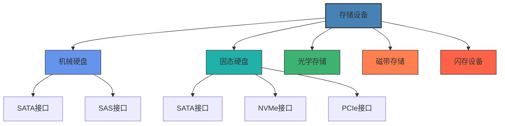
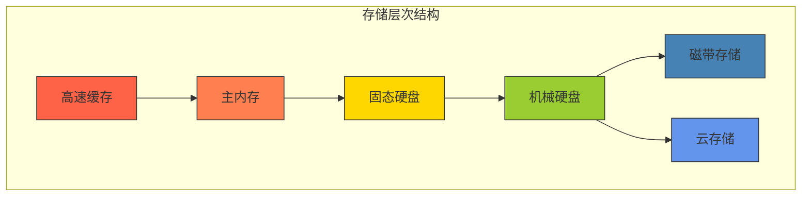
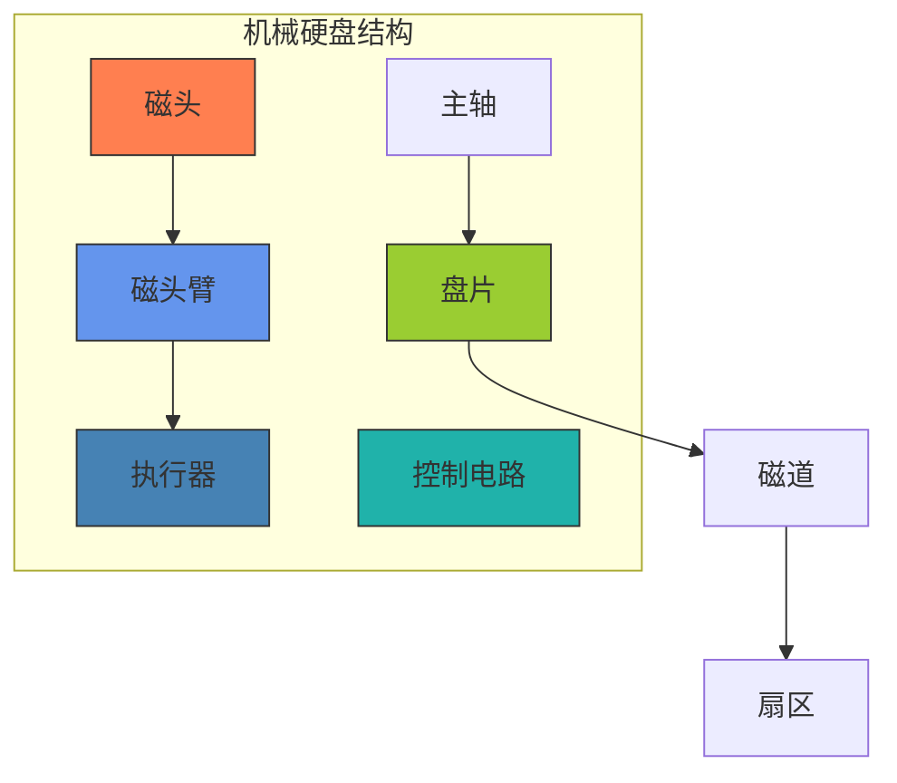
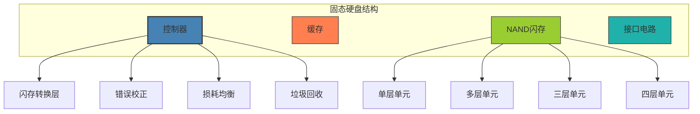
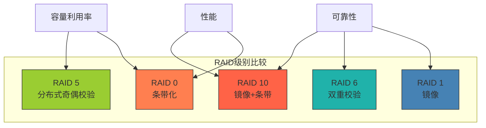

# 存储设备与技术

本章节将详细介绍计算机存储设备的类型、工作原理和性能特点，帮助您全面了解数据如何在计算机中长期保存。

## 学习目标

完成本章学习后，您将能够：
- 区分不同类型的存储设备及其适用场景
- 理解硬盘驱动器和固态驱动器的工作原理
- 掌握存储接口和协议的特点与差异
- 了解RAID技术及其应用
- 评估和选择适合特定需求的存储解决方案

## 教学内容

### 第一部分：存储设备概述

#### 1. 存储层次与分类
- **存储设备在计算机系统中的位置**
  - 存储层次结构回顾
  - 主存与辅存的关系
  - 存储性能金字塔
  - 成本与容量权衡
- **存储设备分类方法**
  - 按介质类型分类
  - 按接口类型分类
  - 按访问方式分类
  - 按用途分类
- **存储设备演进历程**
  - 早期存储设备
  - 磁记录技术发展
  - 光学存储技术发展
  - 固态存储技术发展

#### 2. 存储设备性能指标
- **容量指标**
  - 原始容量
  - 格式化容量
  - 有效容量
  - 容量计算单位
- **速度指标**
  - 顺序读写速度
  - 随机读写速度
  - IOPS(每秒输入/输出操作数)
  - 访问延迟
- **可靠性指标**
  - 平均无故障时间(MTBF)
  - 年化故障率(AFR)
  - 不可恢复错误率
  - 数据保留期
- **其他重要指标**
  - 功耗
  - 发热量
  - 噪音水平
  - 物理尺寸

#### 3. 存储接口与协议
- **内部存储接口**
  - IDE/PATA
  - SATA(I/II/III)
  - SAS
  - PCIe
  - NVMe
- **外部存储接口**
  - USB(1.0/2.0/3.0/4.0)
  - FireWire
  - Thunderbolt
  - eSATA
- **存储协议**
  - AHCI
  - SCSI
  - NVMe
  - UFS
- **接口性能比较**
  - 带宽对比
  - 延迟对比
  - 协议开销
  - 应用场景选择

#### 4. 存储设备管理
- **分区与格式化**
  - 分区表类型(MBR/GPT)
  - 分区管理
  - 文件系统选择
  - 格式化过程
- **存储设备监控**
  - S.M.A.R.T技术
  - 健康状态监测
  - 性能监控
  - 预测性维护
- **存储设备维护**
  - 固件更新
  - 磁盘碎片整理
  - 磁盘清理
  - 数据擦除方法
- **存储容量规划**
  - 容量需求评估
  - 增长预测
  - 扩展策略
  - 成本优化

### 第二部分：硬盘驱动器技术

#### 1. 机械硬盘基本原理
- **硬盘物理结构**
  - 盘片与磁头
  - 主轴马达
  - 磁头臂与执行器
  - 控制电路
- **数据组织方式**
  - 磁道与扇区
  - 柱面
  - 簇与块
  - 寻址方式
- **读写过程**
  - 磁头定位
  - 磁记录原理
  - 读取过程
  - 写入过程
- **性能因素**
  - 转速
  - 平均寻道时间
  - 数据传输率
  - 缓存大小

#### 2. 硬盘技术演进
- **记录密度提升**
  - 纵向磁记录(PMR)
  - 垂直磁记录(VMR)
  - 叠瓦式记录(SMR)
  - 热辅助磁记录(HAMR)
  - 微波辅助磁记录(MAMR)
- **机械结构改进**
  - 流体动力轴承
  - 双级执行器
  - 减震技术
  - 密封氦气技术
- **控制技术进步**
  - 自适应算法
  - 预读技术
  - 错误校正码
  - 坏道管理
- **容量与性能提升**
  - 多盘片技术
  - 高密度盘片
  - 大容量缓存
  - 混合硬盘(SSHD)

#### 3. 企业级硬盘特性
- **企业级硬盘与消费级区别**
  - 可靠性设计
  - 工作负载优化
  - 错误恢复策略
  - 质保期与寿命
- **SAS硬盘技术**
  - SAS接口特点
  - 双端口设计
  - 命令队列深度
  - 企业级应用
- **高可用性设计**
  - 旋转振动传感器
  - 错误恢复控制
  - 电源故障保护
  - 数据完整性保护
- **特殊应用硬盘**
  - 监控专用硬盘
  - NAS专用硬盘
  - 归档专用硬盘
  - 数据中心硬盘

#### 4. 硬盘性能优化
- **硬盘分区优化**
  - 分区对齐
  - 分区大小规划
  - 多分区策略
  - 系统与数据分离
- **文件系统选择**
  - NTFS vs FAT32
  - ext4 vs XFS
  - 日志文件系统
  - 文件系统参数调优
- **缓存策略**
  - 硬盘内部缓存
  - 操作系统缓存
  - 写缓存策略
  - 预读策略
- **硬盘调度算法**
  - FCFS(先来先服务)
  - SSTF(最短寻道时间优先)
  - SCAN(电梯算法)
  - C-SCAN(循环扫描)
  - 操作系统I/O调度器

### 第三部分：固态存储技术

#### 1. 固态硬盘基本原理
- **SSD物理结构**
  - NAND闪存芯片
  - 控制器
  - 缓存
  - 接口电路
- **闪存单元类型**
  - 单层单元(SLC)
  - 多层单元(MLC)
  - 三层单元(TLC)
  - 四层单元(QLC)
- **数据组织方式**
  - 页(Page)
  - 块(Block)
  - 平面(Plane)
  - 通道(Channel)
- **读写擦除过程**
  - 读操作流程
  - 写操作流程
  - 擦除操作
  - 写放大现象

#### 2. SSD控制器技术
- **闪存转换层(FTL)**
  - 逻辑地址映射
  - 物理块管理
  - 坏块管理
  - 磨损均衡
- **错误检测与纠正**
  - ECC技术
  - LDPC码
  - 软决策解码
  - 读取重试
- **垃圾回收与TRIM**
  - 垃圾回收机制
  - TRIM命令
  - 后台整理
  - 空间回收策略
- **缓存与缓冲**
  - DRAM缓存
  - SLC缓存
  - 写缓冲策略
  - 掉电保护

#### 3. SSD接口与协议
- **SATA SSD**
  - SATA协议限制
  - AHCI接口
  - 性能特点
  - 应用场景
- **PCIe SSD**
  - PCIe通道带宽
  - 性能优势
  - 散热考量
  - 企业级应用
- **NVMe协议**
  - NVMe设计理念
  - 命令队列优化
  - 中断处理
  - 并行访问
- **新兴接口技术**
  - U.2/U.3接口
  - EDSFF规范
  - OCP规范
  - CXL接口

#### 4. 3D NAND与新型存储技术
- **3D NAND技术**
  - 垂直堆叠结构
  - 电荷陷阱闪存
  - 层数演进
  - 制造挑战
- **QLC与PLC技术**
  - 多比特存储原理
  - 可靠性挑战
  - 性能特点
  - 应用场景
- **存储级内存(SCM)**
  - 3D XPoint技术
  - 相变内存(PCM)
  - 磁阻内存(MRAM)
  - 电阻式内存(ReRAM)
- **未来存储技术**
  - DNA存储
  - 全息存储
  - 量子存储
  - 纳米管存储

### 第四部分：RAID与存储系统

#### 1. RAID基本概念
- **RAID定义与目标**
  - 冗余磁盘阵列
  - 性能提升
  - 可靠性提高
  - 容量扩展
- **标准RAID级别**
  - RAID 0(条带化)
  - RAID 1(镜像)
  - RAID 5(分布式奇偶校验)
  - RAID 6(双重分布式奇偶校验)
  - RAID 10(镜像+条带)
- **RAID实现方式**
  - 软件RAID
  - 主板RAID
  - 硬件RAID卡
  - 存储系统RAID
- **RAID选择考量**
  - 性能需求
  - 可靠性要求
  - 容量利用率
  - 成本因素

#### 2. 高级RAID技术
- **嵌套RAID级别**
  - RAID 01(RAID 0+1)
  - RAID 50(RAID 5+0)
  - RAID 60(RAID 6+0)
  - 性能与可靠性分析
- **RAID控制器技术**
  - 缓存设计
  - 电池备份单元
  - 写回与直写策略
  - 重建优先级控制
- **RAID管理功能**
  - 在线容量扩展
  - 热备份盘
  - 后台初始化
  - 一致性检查
- **RAID故障恢复**
  - 磁盘故障检测
  - 自动重建
  - 手动重建
  - 数据恢复技术

#### 3. 存储区域网络(SAN)
- **SAN基本概念**
  - 块级存储
  - 光纤通道(FC)
  - iSCSI技术
  - FCoE技术
- **SAN拓扑结构**
  - 点对点
  - 仲裁环
  - 交换式结构
  - 多路径设计
- **SAN性能与可靠性**
  - 带宽管理
  - 负载均衡
  - 多路径I/O
  - 灾难恢复
- **SAN管理**
  - 区域划分
  - LUN屏蔽
  - 存储配置
  - 性能监控

#### 4. 网络附加存储(NAS)与对象存储
- **NAS技术**
  - 文件级存储
  - NFS协议
  - SMB/CIFS协议
  - 应用场景
- **对象存储技术**
  - 对象存储概念
  - S3协议
  - Swift协议
  - 元数据管理
- **统一存储**
  - 块存储、文件存储与对象存储融合
  - 多协议支持
  - 存储虚拟化
  - 管理简化
- **云存储服务**
  - 公有云存储
  - 私有云存储
  - 混合云存储
  - 存储即服务(STaaS)

## 实践项目

1. **存储设备性能测试与分析**：使用专业工具测试不同类型存储设备的性能特性，对比分析顺序读写、随机读写性能
   - 所需时间：8小时
   - 技术要求：存储测试工具使用，数据分析能力
   - 评估标准：测试方法合理性，数据分析深度，结论准确性

2. **RAID系统搭建与测试**：设计并实现不同RAID级别的存储系统，测试其性能和容错能力
   - 所需时间：12小时
   - 技术要求：RAID配置能力，性能测试方法
   - 评估标准：配置正确性，测试方法合理性，分析深度

3. **文件系统性能优化**：针对特定工作负载，测试不同文件系统的性能表现，并进行参数优化
   - 所需时间：10小时
   - 技术要求：文件系统配置能力，性能测试方法
   - 评估标准：测试方法合理性，优化效果，分析深度

4. **存储系统方案设计**：为特定应用场景(如视频编辑、数据库服务器、虚拟化环境)设计合适的存储系统方案
   - 所需时间：15小时
   - 技术要求：存储系统规划能力，方案设计能力
   - 评估标准：需求分析合理性，方案可行性，成本效益分析

## 互动练习

### 自测题

1. **单选题**：以下哪种RAID级别提供数据冗余但不提供性能提升？
   - A. RAID 0
   - B. RAID 1
   - C. RAID 5
   - D. RAID 10
   
   

   
查看答案

   
B. RAID 1。RAID 1实现简单的镜像，提供数据冗余保护，但在大多数情况下不提供写入性能提升，只有在读取时可能有性能提升。

   

2. **多选题**：以下哪些因素会影响SSD的寿命？
   - A. 写入放大
   - B. 闪存单元类型(SLC/MLC/TLC/QLC)
   - C. 操作温度
   - D. 控制器质量
   - E. 硬盘颜色
   
   

   
查看答案

   
A、B、C、D。写入放大、闪存单元类型、操作温度和控制器质量都会影响SSD的寿命，而硬盘颜色是无关因素。

   

3. **判断题**：NVMe协议比AHCI协议更适合SSD，因为它能够支持更高的命令队列深度和并行处理能力。
   
   

   
查看答案

   
正确。NVMe协议专为闪存设备设计，支持高达64K的命令队列深度和多队列并行处理，而AHCI协议最初是为机械硬盘设计，只支持单队列32命令深度。

   

4. **填空题**：在SSD中，最小的读写单位是________，而最小的擦除单位是________。
   
   

   
查看答案

   
页(Page)；块(Block)

   

5. **简答题**：简述机械硬盘和固态硬盘在工作原理上的主要区别，以及各自的优缺点。
   
   

   
参考答案

   
机械硬盘(HDD)使用磁性盘片存储数据，通过机械臂上的磁头在旋转的盘片上读写数据。其优点是容量大、成本低、技术成熟；缺点是机械结构导致访问速度慢、抗震性差、噪音大、功耗高。

   
固态硬盘(SSD)使用闪存芯片存储数据，没有机械部件，通过电子方式访问数据。其优点是读写速度快、抗震性好、噪音低、功耗低；缺点是单位容量成本高、写入次数有限、数据恢复难度大。

   
主要区别在于：HDD是机械设备，存在寻道时间和旋转延迟，随机访问性能差；而SSD是电子设备，访问任何位置的数据时间相近，随机访问性能好。但SSD写入需要先擦除，存在写入放大现象，且闪存单元有擦写寿命限制。

   

### 思考题

1. 随着数据量的爆炸式增长，存储系统面临着容量、性能和可靠性的多重挑战。请分析在大数据时代，存储系统架构的发展趋势，以及如何平衡性能、容量、可靠性和成本这几个因素。

2. 固态硬盘技术发展迅速，从SLC到QLC，从2D NAND到3D NAND。请探讨闪存技术的发展路线图，分析当前技术瓶颈，以及未来可能的突破方向，如SCM(存储级内存)等新型存储技术。

3. 云存储已经成为企业IT基础设施的重要组成部分。请比较公有云存储、私有云存储和混合云存储的优缺点，分析企业在选择存储解决方案时应考虑的关键因素。

4. RAID技术已有数十年历史，但在大容量硬盘时代面临重建时间长、重建过程中再次故障风险高等挑战。请分析传统RAID技术的局限性，以及新一代分布式存储系统(如Ceph、GlusterFS等)如何解决这些问题。

5. 存储系统的性能优化是一个复杂的系统工程。请选择一个特定的应用场景(如数据库、虚拟化、视频编辑等)，分析其存储I/O特点，并提出针对性的存储系统优化方案。

## 学习资源

### 推荐教材
1. 《存储技术基础与实践》(EMC公司)
2. 《固态硬盘技术详解》(Micron Technology)
3. 《存储网络技术与应用》(胡良均)
4. 《RAID存储技术详解》(Robin Harris)
5. 《云存储技术与实践》(刘鹏)

### 在线资源
1. [Storage Review](https://www.storagereview.com/) - 存储设备评测与技术分析
2. [AnandTech Storage](https://www.anandtech.com/tag/storage) - 存储技术深度分析
3. [SNIA技术资源库](https://www.snia.org/education) - 存储网络行业协会教育资源
4. [Western Digital技术博客](https://blog.westerndigital.com/)
5. [Seagate技术文章](https://www.seagate.com/tech-insights/)
6. [三星SSD技术白皮书](https://www.samsung.com/semiconductor/minisite/ssd/support/white-papers/)
7. [英特尔存储技术中心](https://www.intel.com/content/www/us/en/architecture-and-technology/memory-and-storage.html)

### 实验工具
1. [CrystalDiskMark](https://crystalmark.info/en/software/crystaldiskmark/) - 存储性能测试工具
2. [ATTO Disk Benchmark](https://www.atto.com/disk-benchmark/) - 专业存储性能测试
3. [HDDScan](https://hddscan.com/) - 硬盘诊断工具
4. [GSmartControl](https://gsmartcontrol.sourceforge.io/home/) - S.M.A.R.T监控工具
5. [IOmeter](http://www.iometer.org/) - I/O子系统测量工具
6. [FIO](https://github.com/axboe/fio) - 灵活的I/O测试工具

## 评估方式
- 课堂参与：10%
- 实验报告：30%
- 项目作业：30%
- 期末考试：30% 